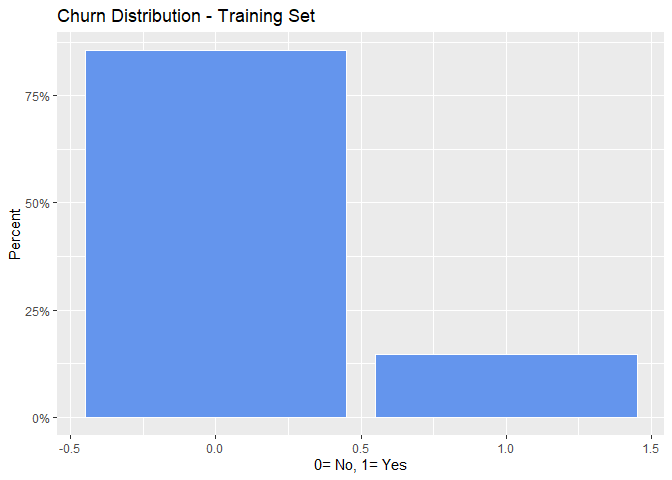
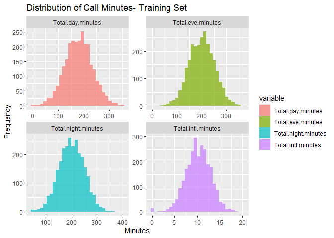
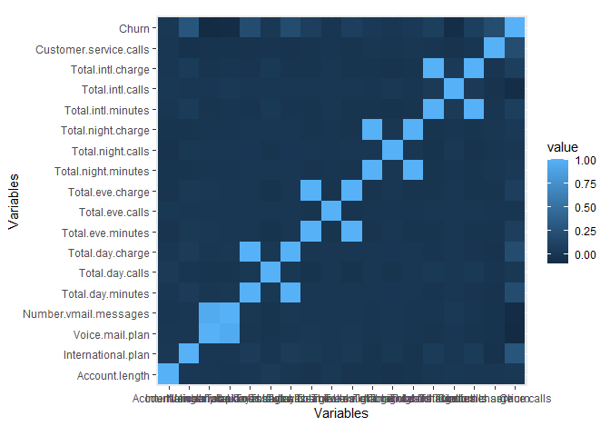
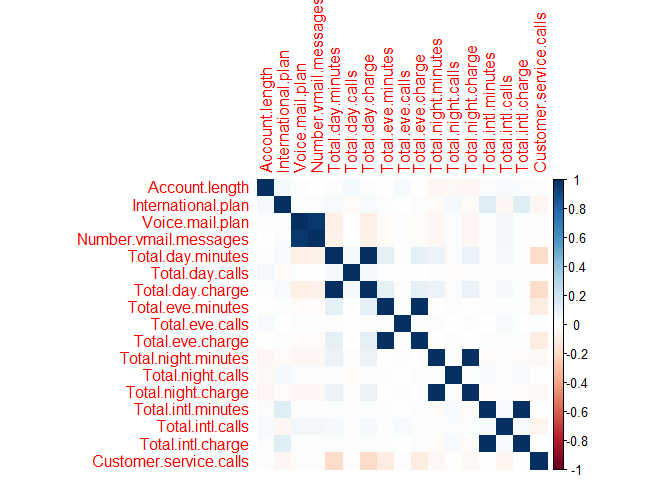
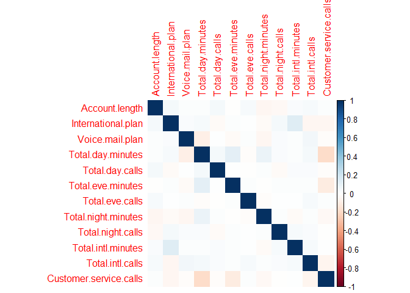
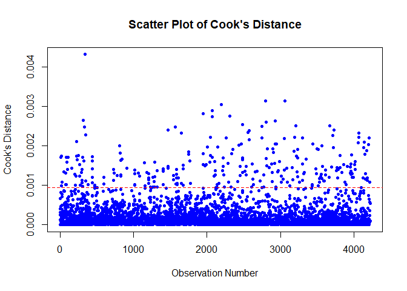

asdfdf
================
Dwight Gonzales
2025-05-16

``` r
training<-read.csv("C:/Users/DWIGHT JIRO/Downloads/churn-bigml-80.csv")
test<-read.csv("C:/Users/DWIGHT JIRO/Downloads/churn-bigml-20.csv")

training$State <- NULL
training$Area.code<- NULL
test$State <- NULL
test$Area.code<- NULL

head(training)
```

    ##   Account.length International.plan Voice.mail.plan Number.vmail.messages
    ## 1            128                 No             Yes                    25
    ## 2            107                 No             Yes                    26
    ## 3            137                 No              No                     0
    ## 4             84                Yes              No                     0
    ## 5             75                Yes              No                     0
    ## 6            118                Yes              No                     0
    ##   Total.day.minutes Total.day.calls Total.day.charge Total.eve.minutes
    ## 1             265.1             110            45.07             197.4
    ## 2             161.6             123            27.47             195.5
    ## 3             243.4             114            41.38             121.2
    ## 4             299.4              71            50.90              61.9
    ## 5             166.7             113            28.34             148.3
    ## 6             223.4              98            37.98             220.6
    ##   Total.eve.calls Total.eve.charge Total.night.minutes Total.night.calls
    ## 1              99            16.78               244.7                91
    ## 2             103            16.62               254.4               103
    ## 3             110            10.30               162.6               104
    ## 4              88             5.26               196.9                89
    ## 5             122            12.61               186.9               121
    ## 6             101            18.75               203.9               118
    ##   Total.night.charge Total.intl.minutes Total.intl.calls Total.intl.charge
    ## 1              11.01               10.0                3              2.70
    ## 2              11.45               13.7                3              3.70
    ## 3               7.32               12.2                5              3.29
    ## 4               8.86                6.6                7              1.78
    ## 5               8.41               10.1                3              2.73
    ## 6               9.18                6.3                6              1.70
    ##   Customer.service.calls Churn
    ## 1                      1 False
    ## 2                      1 False
    ## 3                      0 False
    ## 4                      2 False
    ## 5                      3 False
    ## 6                      0 False

``` r
#Convert the churn column into binary
training$Churn <- as.numeric(factor(training$Churn, levels = c("False", "True"))) - 1
test$Churn <- as.numeric(factor(test$Churn, levels = c("False", "True"))) - 1

#Converting Categorial variable using One Hot Encoding

training$International.plan <- ifelse(training$International.plan == "Yes", 1, 0)
training$Voice.mail.plan <- ifelse(training$Voice.mail.plan == "Yes", 1, 0)


test$International.plan <- ifelse(test$International.plan == "Yes", 1, 0)
test$Voice.mail.plan <- ifelse(test$Voice.mail.plan == "Yes", 1, 0)


#Remove NA's
training<-na.omit(training)
#Remove NA's
test<-na.omit(test)


library(ggplot2)
library(scales)

ggplot(training, 
       aes(x = Churn, y= after_stat(count/sum(count)))) +
  geom_bar(fill = "cornflowerblue", 
           color = "white") + 
  labs(title="Churn Distribution - Training Set", 
       y = "Percent",
       x = "0= No, 1= Yes") +
  scale_y_continuous(labels = percent)
```

<!-- -->

``` r
summary(training[, c("Total.day.minutes", "Total.eve.minutes", "Total.night.minutes", "Total.intl.minutes")])
```

    ##  Total.day.minutes Total.eve.minutes Total.night.minutes Total.intl.minutes
    ##  Min.   :  0.0     Min.   :  0.0     Min.   : 43.7       Min.   : 0.00     
    ##  1st Qu.:143.4     1st Qu.:165.3     1st Qu.:166.9       1st Qu.: 8.50     
    ##  Median :179.9     Median :200.9     Median :201.2       Median :10.20     
    ##  Mean   :179.5     Mean   :200.4     Mean   :201.2       Mean   :10.24     
    ##  3rd Qu.:215.9     3rd Qu.:235.1     3rd Qu.:236.5       3rd Qu.:12.10     
    ##  Max.   :350.8     Max.   :363.7     Max.   :395.0       Max.   :20.00

``` r
call_data <- training[, c("Total.day.minutes", "Total.eve.minutes", "Total.night.minutes", "Total.intl.minutes")]
call_data_long <- reshape2::melt(call_data)

ggplot(call_data_long, aes(x = value, fill = variable)) +
  geom_histogram(bins = 30, alpha = 0.7) +
  facet_wrap(~variable, scales = "free") +
  labs(title = "Distribution of Call Minutes- Training Set", x = "Minutes", y = "Frequency")
```

<!-- -->

``` r
numeric_vars <- training[sapply(training, is.numeric)]
cor_matrix <- cor(numeric_vars, use = "complete.obs")

library(reshape)

melted_corrmat_pearson <- melt(cor_matrix)
head(melted_corrmat_pearson)
```

    ##                      X1             X2        value
    ## 1        Account.length Account.length  1.000000000
    ## 2    International.plan Account.length  0.024500061
    ## 3       Voice.mail.plan Account.length  0.002447532
    ## 4 Number.vmail.messages Account.length -0.002995980
    ## 5     Total.day.minutes Account.length  0.002847460
    ## 6       Total.day.calls Account.length  0.038861909

``` r
ggplot(melted_corrmat_pearson, aes(x = X1, y = X2, fill = value)) + 
  geom_tile() + 
  labs(x = 'Variables', y = 'Variables') + 
  coord_fixed()
```

<!-- -->

``` r
# Class imbalance for Churn for Training and Test

ggplot(training, 
       aes(x = Churn, y= after_stat(count/sum(count)))) +
  geom_bar(fill = "cornflowerblue", 
           color = "white") + 
  labs(title="Churn Distribution - Training Set", 
       y = "Percent",
       x = "0= No, 1= Yes") +
  scale_y_continuous(labels = percent)
```

<!-- -->

``` r
# We can see that there is a significant imbalance, which can be biased if not fixed

#Balancing Churn

predictor_variables <- training[,-18] 
response_variable <- training$Churn 
levels(response_variable) <- c('0', '1') 
levels(test$Churn)<- c('0', '1') 


library(smotefamily)
library(caret)
library(nnet)

set.seed(123)
smote_data <- SMOTE(X = predictor_variables,
                    target = response_variable,
                    K = 5,              
                    dup_size = 0)        

balanced_data <- smote_data$data
balanced_data$class <- as.factor(balanced_data$class)

# Assumptions

cor_matrix <- cor(balanced_data[sapply(balanced_data, is.numeric)])
corrplot::corrplot(cor_matrix, method = "color")
```

<!-- -->

``` r
# We can see that Total eve / Day charge is highly correlated to total day/eve minutes aslo voice mail plan. Thus consider removing it 
library(dplyr) 

balanced_data <- balanced_data %>% 
  select(-Total.day.charge, -Total.eve.charge, -Total.night.charge, -Total.intl.charge,- Number.vmail.messages)

cor_matrix <- cor(balanced_data[sapply(balanced_data, is.numeric)])
corrplot::corrplot(cor_matrix, method = "color")
```

<!-- -->

``` r
# Train a logistic regression model
lr_model <- glm(class ~ ., data = balanced_data, family = "binomial")
library(car)


vif_values <- vif(lr_model)
vif_values
```

    ##         Account.length     International.plan        Voice.mail.plan 
    ##               1.012595               1.104319               1.030973 
    ##      Total.day.minutes        Total.day.calls      Total.eve.minutes 
    ##               1.200149               1.011399               1.047795 
    ##        Total.eve.calls    Total.night.minutes      Total.night.calls 
    ##               1.006317               1.024635               1.009820 
    ##     Total.intl.minutes       Total.intl.calls Customer.service.calls 
    ##               1.021538               1.019316               1.262828

``` r
#All VIF values are well below 5 - No strong multicollinearity

cooks_d <- cooks.distance(lr_model)
plot(cooks_d, 
     pch = 20,             # solid dots
     main = "Scatter Plot of Cook's Distance",
     xlab = "Observation Number",
     ylab = "Cook's Distance",
     col = "blue")

abline(h = 4 / length(cooks_d), col = "red", lty = 2)
```

<!-- -->

``` r
# No extreme outliers

summary(lr_model)
```

    ## 
    ## Call:
    ## glm(formula = class ~ ., family = "binomial", data = balanced_data)
    ## 
    ## Coefficients:
    ##                          Estimate Std. Error z value Pr(>|z|)    
    ## (Intercept)            -7.4286318  0.4933978 -15.056  < 2e-16 ***
    ## Account.length          0.0004939  0.0009820   0.503    0.615    
    ## International.plan      2.6765404  0.1279591  20.917  < 2e-16 ***
    ## Voice.mail.plan        -0.9294957  0.0998466  -9.309  < 2e-16 ***
    ## Total.day.minutes       0.0137866  0.0007190  19.176  < 2e-16 ***
    ## Total.day.calls         0.0043336  0.0019723   2.197    0.028 *  
    ## Total.eve.minutes       0.0063733  0.0007972   7.995 1.30e-15 ***
    ## Total.eve.calls         0.0011931  0.0019998   0.597    0.551    
    ## Total.night.minutes     0.0032084  0.0008065   3.978 6.95e-05 ***
    ## Total.night.calls      -0.0004293  0.0020430  -0.210    0.834    
    ## Total.intl.minutes      0.0936675  0.0150697   6.216 5.11e-10 ***
    ## Total.intl.calls       -0.0854097  0.0167003  -5.114 3.15e-07 ***
    ## Customer.service.calls  0.6803908  0.0299711  22.702  < 2e-16 ***
    ## ---
    ## Signif. codes:  0 '***' 0.001 '**' 0.01 '*' 0.05 '.' 0.1 ' ' 1
    ## 
    ## (Dispersion parameter for binomial family taken to be 1)
    ## 
    ##     Null deviance: 5820.3  on 4217  degrees of freedom
    ## Residual deviance: 4208.1  on 4205  degrees of freedom
    ## AIC: 4234.1
    ## 
    ## Number of Fisher Scoring iterations: 5

``` r
# Make predictions on the test set
pred_probs <- predict(lr_model, newdata = test, type = "response")
pred_class <- ifelse(pred_probs > 0.5, 1, 0)
table(pred_class)
```

    ## pred_class
    ##   0   1 
    ## 482 185

``` r
table(Predicted = pred_class, Actual = test$Churn)
```

    ##          Actual
    ## Predicted   0   1
    ##         0 458  24
    ##         1 114  71

``` r
pred_class <- factor(pred_class, levels = c(0, 1))
actual_class <- factor(test$Churn, levels = c(0, 1))

conf_matrix <- confusionMatrix(pred_class, actual_class, positive = "1")


conf_matrix <- confusionMatrix(pred_class, actual_class, positive = "1")

accuracy <- conf_matrix$overall["Accuracy"]
precision <- conf_matrix$byClass["Precision"]
recall <- conf_matrix$byClass["Sensitivity"]
f1 <- 2 * (precision * recall) / (precision + recall)

accuracy
```

    ##  Accuracy 
    ## 0.7931034

``` r
precision
```

    ## Precision 
    ## 0.3837838

``` r
recall
```

    ## Sensitivity 
    ##   0.7473684

``` r
f1
```

    ## Precision 
    ## 0.5071429

``` r
#Lasso Regression

library(glmnet)

x <- as.matrix(balanced_data[, -ncol(balanced_data)])
y <- balanced_data$class
set.seed(123)
cv_model <- cv.glmnet(x, y, family = "binomial", alpha = 1)  
best_lambda <- cv_model$lambda.min

lasso_regression <- glmnet(x, y, family = "binomial", alpha = 1, lambda = best_lambda)

drop_cols <- c("Churn", "Total.day.charge", "Total.eve.charge", 
               "Total.night.charge", "Total.intl.charge", "Number.vmail.messages")

test_x <- as.matrix(test[, !names(test) %in% drop_cols])
test_y <- test$Churn

pred_prob <- predict(lasso_regression, newx = test_x)
pred_class <- factor(ifelse(pred_prob >= 0.5, 1, 0), levels = c(0, 1))
test_y <- factor(test_y, levels = c("0", "1"))
pred_class <- factor(pred_class, levels = c("0", "1"))
conf_matrix_lasso <- confusionMatrix(pred_class, test_y, positive = "1")
conf_matrix_lasso
```

    ## Confusion Matrix and Statistics
    ## 
    ##           Reference
    ## Prediction   0   1
    ##          0 500  40
    ##          1  72  55
    ##                                           
    ##                Accuracy : 0.8321          
    ##                  95% CI : (0.8015, 0.8597)
    ##     No Information Rate : 0.8576          
    ##     P-Value [Acc > NIR] : 0.971648        
    ##                                           
    ##                   Kappa : 0.3973          
    ##                                           
    ##  Mcnemar's Test P-Value : 0.003398        
    ##                                           
    ##             Sensitivity : 0.57895         
    ##             Specificity : 0.87413         
    ##          Pos Pred Value : 0.43307         
    ##          Neg Pred Value : 0.92593         
    ##              Prevalence : 0.14243         
    ##          Detection Rate : 0.08246         
    ##    Detection Prevalence : 0.19040         
    ##       Balanced Accuracy : 0.72654         
    ##                                           
    ##        'Positive' Class : 1               
    ## 

``` r
accuracy <- conf_matrix_lasso$overall["Accuracy"]


precision <- conf_matrix_lasso$byClass["Precision"]

recall <- conf_matrix_lasso$byClass["Sensitivity"]

f1 <- 2 * (precision * recall) / (precision + recall)

# Print results
accuracy
```

    ## Accuracy 
    ## 0.832084

``` r
precision
```

    ## Precision 
    ## 0.4330709

``` r
recall
```

    ## Sensitivity 
    ##   0.5789474

``` r
f1
```

    ## Precision 
    ## 0.4954955
