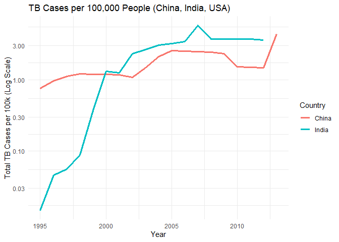
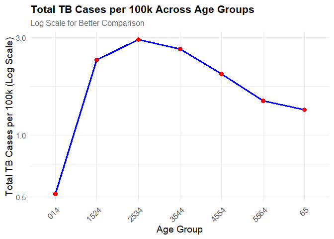
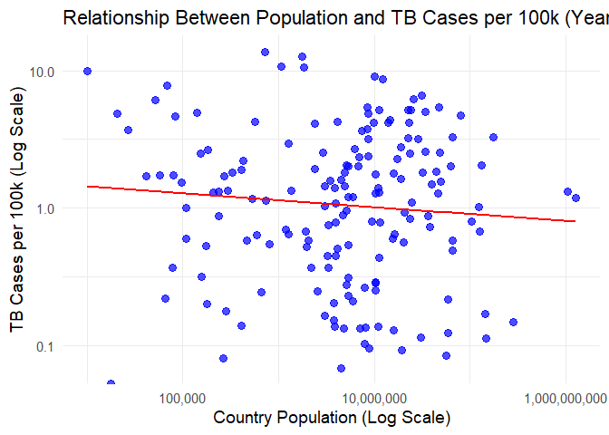

TB Data Analysis
================
Your Name
2025-02-16

## Load Required Libraries

``` r
library(tidyverse)
library(dplyr)
library(ggplot2)
library(scales)
```

## Load and Preview Data

``` r
df1 <- as_tibble(who)
df2 <- as_tibble(population)

# Preview datasets
head(df1)
```

    ## # A tibble: 6 × 60
    ##   country   iso2  iso3   year new_sp_m014 new_sp_m1524 new_sp_m2534 new_sp_m3544
    ##   <chr>     <chr> <chr> <dbl>       <dbl>        <dbl>        <dbl>        <dbl>
    ## 1 Afghanis… AF    AFG    1980          NA           NA           NA           NA
    ## 2 Afghanis… AF    AFG    1981          NA           NA           NA           NA
    ## 3 Afghanis… AF    AFG    1982          NA           NA           NA           NA
    ## 4 Afghanis… AF    AFG    1983          NA           NA           NA           NA
    ## 5 Afghanis… AF    AFG    1984          NA           NA           NA           NA
    ## 6 Afghanis… AF    AFG    1985          NA           NA           NA           NA
    ## # ℹ 52 more variables: new_sp_m4554 <dbl>, new_sp_m5564 <dbl>,
    ## #   new_sp_m65 <dbl>, new_sp_f014 <dbl>, new_sp_f1524 <dbl>,
    ## #   new_sp_f2534 <dbl>, new_sp_f3544 <dbl>, new_sp_f4554 <dbl>,
    ## #   new_sp_f5564 <dbl>, new_sp_f65 <dbl>, new_sn_m014 <dbl>,
    ## #   new_sn_m1524 <dbl>, new_sn_m2534 <dbl>, new_sn_m3544 <dbl>,
    ## #   new_sn_m4554 <dbl>, new_sn_m5564 <dbl>, new_sn_m65 <dbl>,
    ## #   new_sn_f014 <dbl>, new_sn_f1524 <dbl>, new_sn_f2534 <dbl>, …

``` r
head(df2)
```

    ## # A tibble: 6 × 3
    ##   country      year population
    ##   <chr>       <dbl>      <dbl>
    ## 1 Afghanistan  1995   17586073
    ## 2 Afghanistan  1996   18415307
    ## 3 Afghanistan  1997   19021226
    ## 4 Afghanistan  1998   19496836
    ## 5 Afghanistan  1999   19987071
    ## 6 Afghanistan  2000   20595360

``` r
# Number of rows and columns
ncol(df1)
```

    ## [1] 60

``` r
ncol(df2)
```

    ## [1] 3

``` r
nrow(df1)
```

    ## [1] 7240

``` r
nrow(df2)
```

    ## [1] 4060

## Check for Anomalies in Population Data

``` r
summary(population)
```

    ##    country               year        population       
    ##  Length:4060        Min.   :1995   Min.   :1.129e+03  
    ##  Class :character   1st Qu.:1999   1st Qu.:6.029e+05  
    ##  Mode  :character   Median :2004   Median :5.319e+06  
    ##                     Mean   :2004   Mean   :3.003e+07  
    ##                     3rd Qu.:2009   3rd Qu.:1.855e+07  
    ##                     Max.   :2013   Max.   :1.386e+09

``` r
str(population)
```

    ## tibble [4,060 × 3] (S3: tbl_df/tbl/data.frame)
    ##  $ country   : chr [1:4060] "Afghanistan" "Afghanistan" "Afghanistan" "Afghanistan" ...
    ##  $ year      : num [1:4060] 1995 1996 1997 1998 1999 ...
    ##  $ population: num [1:4060] 17586073 18415307 19021226 19496836 19987071 ...

## Convert Year Column to Integer and Format Data

``` r
population$year <- as.integer(population$year)
population_tidy <- as_tibble(population)
str(population_tidy)
```

    ## tibble [4,060 × 3] (S3: tbl_df/tbl/data.frame)
    ##  $ country   : chr [1:4060] "Afghanistan" "Afghanistan" "Afghanistan" "Afghanistan" ...
    ##  $ year      : int [1:4060] 1995 1996 1997 1998 1999 2000 2001 2002 2003 2004 ...
    ##  $ population: num [1:4060] 17586073 18415307 19021226 19496836 19987071 ...

## Tidy WHO Data

``` r
who_tidy <- who %>% pivot_longer(
  cols = new_sp_m014:newrel_f65,
  names_to = c("diagnosis", "gender", "age"),
  names_pattern = "new_?(.*)_(.)(.*)",
  values_to = "count"
)
who_tidy
```

    ## # A tibble: 405,440 × 8
    ##    country     iso2  iso3   year diagnosis gender age   count
    ##    <chr>       <chr> <chr> <dbl> <chr>     <chr>  <chr> <dbl>
    ##  1 Afghanistan AF    AFG    1980 sp        m      014      NA
    ##  2 Afghanistan AF    AFG    1980 sp        m      1524     NA
    ##  3 Afghanistan AF    AFG    1980 sp        m      2534     NA
    ##  4 Afghanistan AF    AFG    1980 sp        m      3544     NA
    ##  5 Afghanistan AF    AFG    1980 sp        m      4554     NA
    ##  6 Afghanistan AF    AFG    1980 sp        m      5564     NA
    ##  7 Afghanistan AF    AFG    1980 sp        m      65       NA
    ##  8 Afghanistan AF    AFG    1980 sp        f      014      NA
    ##  9 Afghanistan AF    AFG    1980 sp        f      1524     NA
    ## 10 Afghanistan AF    AFG    1980 sp        f      2534     NA
    ## # ℹ 405,430 more rows

## Merge Datasets and Clean Data

``` r
tuberculosis <- merge(population_tidy, who_tidy, by = c("country", "year"), all = TRUE)
tuberculosis <- na.omit(tuberculosis)
head(tuberculosis)
```

    ##         country year population iso2 iso3 diagnosis gender  age count
    ## 962 Afghanistan 1997   19021226   AF  AFG        sp      m 5564     2
    ## 966 Afghanistan 1997   19021226   AF  AFG        sp      m 1524    10
    ## 972 Afghanistan 1997   19021226   AF  AFG        sp      m  014     0
    ## 973 Afghanistan 1997   19021226   AF  AFG        sp      f 1524    38
    ## 975 Afghanistan 1997   19021226   AF  AFG        sp      m 4554     5
    ## 979 Afghanistan 1997   19021226   AF  AFG        sp      f 4554     8

``` r
str(tuberculosis)
```

    ## 'data.frame':    74940 obs. of  9 variables:
    ##  $ country   : chr  "Afghanistan" "Afghanistan" "Afghanistan" "Afghanistan" ...
    ##  $ year      : num  1997 1997 1997 1997 1997 ...
    ##  $ population: num  1.9e+07 1.9e+07 1.9e+07 1.9e+07 1.9e+07 ...
    ##  $ iso2      : chr  "AF" "AF" "AF" "AF" ...
    ##  $ iso3      : chr  "AFG" "AFG" "AFG" "AFG" ...
    ##  $ diagnosis : chr  "sp" "sp" "sp" "sp" ...
    ##  $ gender    : chr  "m" "m" "m" "f" ...
    ##  $ age       : chr  "5564" "1524" "014" "1524" ...
    ##  $ count     : num  2 10 0 38 5 8 36 0 5 3 ...
    ##  - attr(*, "na.action")= 'omit' Named int [1:330523] 1 2 3 4 5 6 7 8 9 10 ...
    ##   ..- attr(*, "names")= chr [1:330523] "1" "2" "3" "4" ...

## TB Cases Among Men and Women in the 21st Century (USA)

``` r
tb_us_21st <- tuberculosis %>%
  filter(iso3 == "USA", year >= 2001) %>%
  group_by(gender) %>%
  summarise(total_cases = sum(count, na.rm = TRUE))

print(tb_us_21st)
```

    ## # A tibble: 2 × 2
    ##   gender total_cases
    ##   <chr>        <dbl>
    ## 1 f            43982
    ## 2 m            73769

## Identify Highest and Lowest TB Rates

``` r
tuberculosis <- tuberculosis %>%
  mutate(cases_per_100k = (count / population) * 100000)

highest_cases <- tuberculosis %>%
  arrange(desc(cases_per_100k)) %>%
  slice(1)

lowest_cases <- tuberculosis %>%
  arrange(cases_per_100k) %>%
  slice(1)

print(highest_cases %>% select(country, year, cases_per_100k))
```

    ##   country year cases_per_100k
    ## 1   Samoa 2009       601.5029

``` r
print(lowest_cases %>% select(country, year, cases_per_100k))
```

    ##       country year cases_per_100k
    ## 1 Afghanistan 1997              0

## TB Cases per 100k in China, India, and USA Over Time

``` r
tb_selected <- tuberculosis %>%
  filter(country %in% c("China", "India", "United States")) %>%
  group_by(country, year) %>%
  summarise(total_cases_per_100k = sum(count) / sum(population) * 100000, .groups = "drop")

ggplot(tb_selected, aes(x = year, y = total_cases_per_100k, color = country)) +
  geom_line(linewidth = 1.2) +  
  scale_y_log10() +  
  labs(
    title = "TB Cases per 100,000 People (China, India, USA)",
    x = "Year",
    y = "Total TB Cases per 100k (Log Scale)",
    color = "Country"
  ) +
  theme_minimal()
```

<!-- --> Based on
this trend, it shows how fast TB cases in India rises. In the span of 5
years from 0.3 to 1 (log scale) the rise incline rapidly and over coming
China starting on year 2000 to present

## TB Cases Across Age Groups

``` r
tb_age_group <- tuberculosis %>%
  group_by(age) %>%
  summarise(
    total_cases_per_100k = sum(count, na.rm = TRUE) / sum(population, na.rm = TRUE) * 100000,
    .groups = "drop"
  )

tb_age_group <- tb_age_group %>%
  mutate(age = factor(age, levels = unique(age)))

ggplot(tb_age_group, aes(x = age, y = total_cases_per_100k, group = 1)) +
  geom_line(color = "blue", size = 1.2) +   
  geom_point(color = "red", size = 3) +   
  scale_y_log10() +  
  labs(
    title = "Total TB Cases per 100k Across Age Groups",
    subtitle = "Log Scale for Better Comparison",
    x = "Age Group",
    y = "Total TB Cases per 100k (Log Scale)"
  ) +
  theme_minimal(base_size = 14) +  
  theme(
    axis.text.x = element_text(angle = 45, hjust = 1),  
    plot.title = element_text(face = "bold", size = 16),
    plot.subtitle = element_text(size = 12, color = "gray40")
  )
```

<!-- -->

Based on this graph, ages 25-34 has the most total TB cases across ages
followed by succeeding years. This depicts that 0-14 years old TB cases
occured at very low rate wherein ages 15 and above started to be more
fragile or vulnerable to TB cases

## Relationship Between Population and TB Cases per 100k (Year 2000)

``` r
tb_2000 <- tuberculosis %>%
  filter(year == 2000) %>%
  group_by(country, population) %>%
  summarise(
    cases_per_100k = sum(count) / sum(population) * 100000,
    .groups = "drop"
  )  

ggplot(tb_2000, aes(x = population, y = cases_per_100k)) +
  geom_point(color = "blue", alpha = 0.7, size = 3) +  
  geom_smooth(method = "lm", color = "red", se = FALSE) +  
  scale_x_log10(labels = comma) +  
  scale_y_log10(labels = comma) +  
  labs(
    title = "Relationship Between Population and TB Cases per 100k (Year 2000)",
    x = "Country Population (Log Scale)",
    y = "TB Cases per 100k (Log Scale)"
  ) +
  theme_minimal(base_size = 14)
```

<!-- -->

We see here that most points do not lie in our linear trend. It shows
that they have no relation.There is no strong relationship between
population size and TB cases per 100k. Other factors such as healthcare
infrastructure, socioeconomic conditions, and government intervention
likely play a more significant role in determining TB prevalence.
