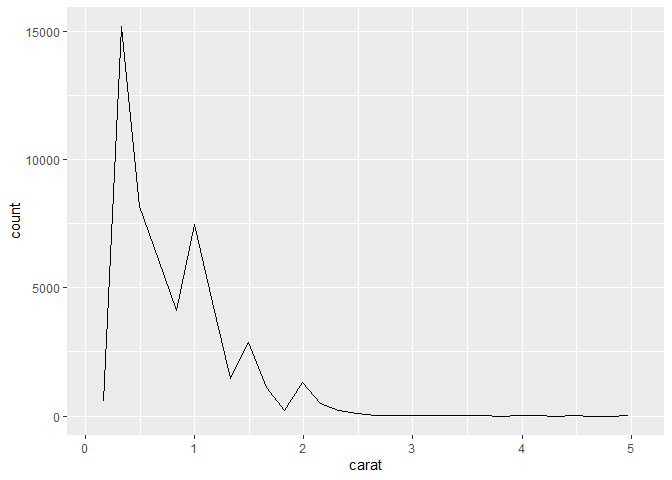
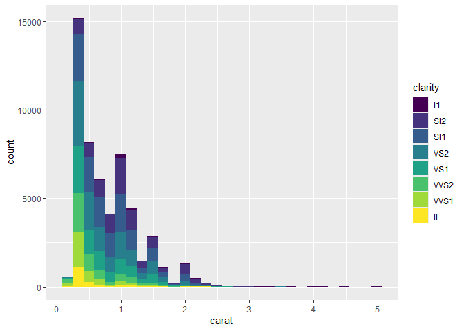
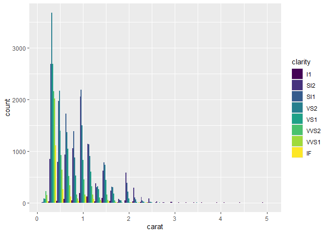

FA3_EDA_GONZALES
================
Dwight Gonzales
2025-02-28

``` r
library(ggplot2)
library(dplyr)

df<-diamonds

p <- ggplot() + 
  geom_histogram(aes(x = carat), data = df)

p
```

<!-- -->

``` r
p1 <- ggplot(df) +
  layer(
    mapping = aes(x = carat),  # Specify x and y
    geom = "bar", 
    stat = "bin", 
    position = "stack",
    data = df, 
    params = list(na.rm = TRUE)
  )

p1
```

<!-- -->

``` r
p2<-ggplot(df) +
  layer(
    mapping = aes(x = carat),  # Specify x and y
    geom = "line", 
    stat = "bin", 
    position = "identity",
    data = df, 
    params = list(na.rm = TRUE)
  )


p2
```

<!-- -->

``` r
p3<-ggplot(df) +
  layer(
    mapping = aes(x = carat,fill=clarity),  
    geom = "bar", 
    stat = "bin", 
    position = "stack",
    data = df, 
    params = list(na.rm = TRUE)
  )


p3
```

<!-- -->

``` r
p4 <- ggplot(data = diamonds) + 
  layer(
    mapping = aes(x = carat, fill = clarity),  
    stat = "bin",
    geom = "bar",
    position = "dodge",  # Changed from "stack" to "dodge"
    data = diamonds,
    params = list(na.rm = FALSE)
  )

p4
```

<!-- -->

“stack” (default) Stacks bars on top of each other Show total counts
while distinguishing groups “dodge” Places bars side by side Compare
group sizes directly
