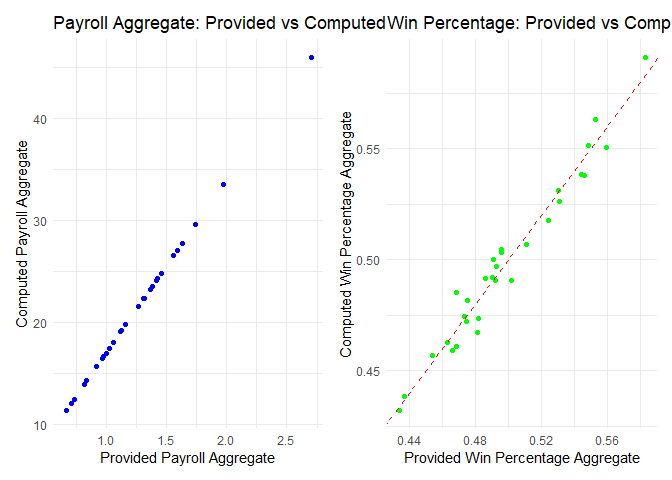
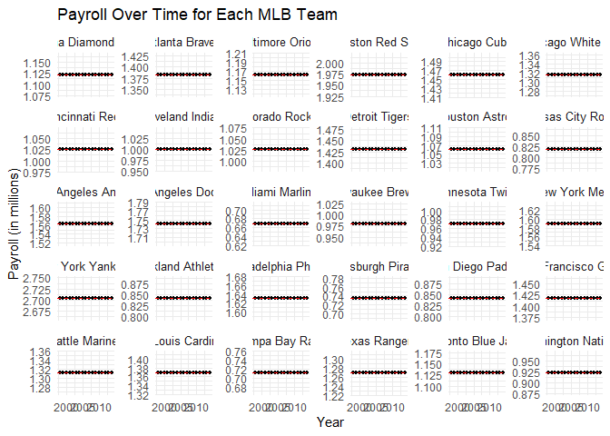
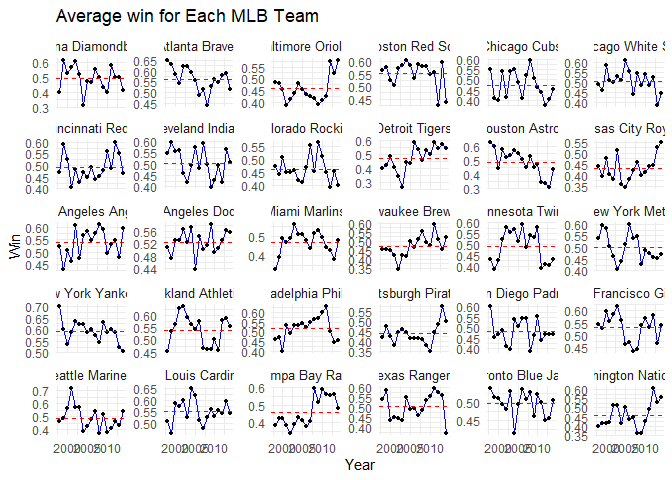
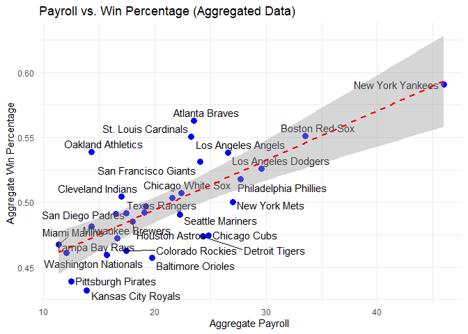

FA3_DSC1107_GONZALES
================
Dwight Gonzales
2025-02-23

Import the data into a tibble called mlb_raw and print it.

``` r
library(tidyverse)
library(ggrepel)
library(kableExtra)
library(patchwork)
library(ggplot2)
load("C:/Users/DWIGHT JIRO/Downloads/ml_pay.rdata")
df <- as_tibble(ml_pay)
head(df)
```

    ## # A tibble: 6 × 54
    ##   payroll avgwin Team.name.2014  p1998 p1999 p2000 p2001 p2002 p2003 p2004 p2005
    ##     <dbl>  <dbl> <fct>           <dbl> <dbl> <dbl> <dbl> <dbl> <dbl> <dbl> <dbl>
    ## 1    1.12  0.490 Arizona Diamon…  31.6  70.5  81.0  81.2 103.   80.6  70.2  63.0
    ## 2    1.38  0.553 Atlanta Braves   61.7  74.9  84.5  91.9  93.5 106.   88.5  85.1
    ## 3    1.16  0.454 Baltimore Orio…  71.9  72.2  81.4  72.4  60.5  73.9  51.2  74.6
    ## 4    1.97  0.549 Boston Red Sox   59.5  71.7  77.9 110.  108.   99.9 125.  121. 
    ## 5    1.46  0.474 Chicago Cubs     49.8  42.1  60.5  64.0  75.7  79.9  91.1  87.2
    ## 6    1.32  0.511 Chicago White …  35.2  24.5  31.1  62.4  57.1  51.0  65.2  75.2
    ## # ℹ 43 more variables: p2006 <dbl>, p2007 <dbl>, p2008 <dbl>, p2009 <dbl>,
    ## #   p2010 <dbl>, p2011 <dbl>, p2012 <dbl>, p2013 <dbl>, p2014 <dbl>,
    ## #   X2014 <int>, X2013 <int>, X2012 <int>, X2011 <int>, X2010 <int>,
    ## #   X2009 <int>, X2008 <int>, X2007 <int>, X2006 <int>, X2005 <int>,
    ## #   X2004 <int>, X2003 <int>, X2002 <int>, X2001 <int>, X2000 <int>,
    ## #   X1999 <int>, X1998 <int>, X2014.pct <dbl>, X2013.pct <dbl>,
    ## #   X2012.pct <dbl>, X2011.pct <dbl>, X2010.pct <dbl>, X2009.pct <dbl>, …

How many rows and columns does the data have?

``` r
dimensions<-dim(df)
cat("Number of rows and columns:", dimensions[1], "rows and", dimensions[2], "columns\n")
```

    ## Number of rows and columns: 30 rows and 54 columns

Does this match up with the data description given above?

\#Indeed it match the data description given above

``` r
mlb_yearly <- df %>%
  pivot_longer(cols = starts_with("p"), names_to = "year", values_to = "payroll") %>%
  separate(year, into = c("drop", "year"), sep = "p") %>%  # Separate 'p1998' -> 'year'
  select(-drop) %>%  # Remove the extra column
  left_join(
    df %>%
      pivot_longer(cols = starts_with("X"), names_to = "year", values_to = "num_wins") %>%
      separate(year, into = c("drop", "year"), sep = "X") %>%
      select(-drop),
    by = c("Team.name.2014", "year")
  ) %>%
  left_join(
    df %>%
      pivot_longer(cols = matches("^X\\d+\\.pct$"), names_to = "year", values_to = "pct_wins") %>%
      separate(year, into = c("drop", "year"), sep = "(X|\\.pct)") %>%  # Adjusted regex
      select(-drop),
    by = c("Team.name.2014", "year")
  ) %>%
  rename(team = Team.name.2014) %>%
  mutate(year = as.numeric(year)) %>%  # Convert year to numeric
  select(team, year, payroll, pct_wins, num_wins)

mlb_aggregate_computed <- mlb_yearly %>%
  group_by(team) %>%
  summarise(
    payroll_aggregate_computed = sum(payroll, na.rm = TRUE),
    pct_wins_aggregate_computed = mean(pct_wins, na.rm = TRUE)
  )

mlb_aggregate <- df %>%
  select(team = Team.name.2014, payroll_aggregate = payroll, pct_wins_aggregate = avgwin)

mlb_aggregate_joined <- mlb_aggregate %>%
  left_join(mlb_aggregate_computed, by = "team")

head(mlb_aggregate)
```

    ## # A tibble: 6 × 3
    ##   team                 payroll_aggregate pct_wins_aggregate
    ##   <fct>                            <dbl>              <dbl>
    ## 1 Arizona Diamondbacks              1.12              0.490
    ## 2 Atlanta Braves                    1.38              0.553
    ## 3 Baltimore Orioles                 1.16              0.454
    ## 4 Boston Red Sox                    1.97              0.549
    ## 5 Chicago Cubs                      1.46              0.474
    ## 6 Chicago White Sox                 1.32              0.511

``` r
head(mlb_yearly)
```

    ## # A tibble: 6 × 5
    ##   team                  year payroll pct_wins num_wins
    ##   <fct>                <dbl>   <dbl>    <dbl>    <dbl>
    ## 1 Arizona Diamondbacks    NA   NA      NA           NA
    ## 2 Arizona Diamondbacks  1998    1.12    0.399       65
    ## 3 Arizona Diamondbacks  1999    1.12    0.613      100
    ## 4 Arizona Diamondbacks  2000    1.12    0.525       85
    ## 5 Arizona Diamondbacks  2001    1.12    0.568       92
    ## 6 Arizona Diamondbacks  2002    1.12    0.605       98

``` r
head(mlb_aggregate_computed)
```

    ## # A tibble: 6 × 3
    ##   team                 payroll_aggregate_computed pct_wins_aggregate_computed
    ##   <fct>                                     <dbl>                       <dbl>
    ## 1 Arizona Diamondbacks                       19.1                       0.492
    ## 2 Atlanta Braves                             23.5                       0.563
    ## 3 Baltimore Orioles                          19.7                       0.457
    ## 4 Boston Red Sox                             33.5                       0.551
    ## 5 Chicago Cubs                               24.8                       0.475
    ## 6 Chicago White Sox                          22.4                       0.507

``` r
head(mlb_aggregate_joined)
```

    ## # A tibble: 6 × 5
    ##   team               payroll_aggregate pct_wins_aggregate payroll_aggregate_co…¹
    ##   <fct>                          <dbl>              <dbl>                  <dbl>
    ## 1 Arizona Diamondba…              1.12              0.490                   19.1
    ## 2 Atlanta Braves                  1.38              0.553                   23.5
    ## 3 Baltimore Orioles               1.16              0.454                   19.7
    ## 4 Boston Red Sox                  1.97              0.549                   33.5
    ## 5 Chicago Cubs                    1.46              0.474                   24.8
    ## 6 Chicago White Sox               1.32              0.511                   22.4
    ## # ℹ abbreviated name: ¹​payroll_aggregate_computed
    ## # ℹ 1 more variable: pct_wins_aggregate_computed <dbl>

How many rows do mlb_aggregate and mlb_yearly contain, and why?

``` r
dimension_mlb_aggregate <- nrow(mlb_aggregate)
dimension_mlb_yearly <- nrow(mlb_yearly)  # Fixed variable name

cat("Number of rows for mlb_aggregate:", dimension_mlb_aggregate, "\n")
```

    ## Number of rows for mlb_aggregate: 30

``` r
cat("Number of rows for mlb_yearly:", dimension_mlb_yearly, "\n")
```

    ## Number of rows for mlb_yearly: 540

``` r
# Since we tidy the data, the rows will turn into column and columns to to row, summarizing the data


p1 <- ggplot(mlb_aggregate_joined, aes(x = payroll_aggregate, y = payroll_aggregate_computed)) +
  geom_point(color = "blue") +
  geom_abline(slope = 1, intercept = 0, linetype = "dashed", color = "red") + 
  labs(title = "Payroll Aggregate: Provided vs Computed",
       x = "Provided Payroll Aggregate",
       y = "Computed Payroll Aggregate") +
  theme_minimal()

# Scatter plot of win percentage aggregates
p2 <- ggplot(mlb_aggregate_joined, aes(x = pct_wins_aggregate, y = pct_wins_aggregate_computed)) +
  geom_point(color = "green") +
  geom_abline(slope = 1, intercept = 0, linetype = "dashed", color = "red") +
  labs(title = "Win Percentage: Provided vs Computed",
       x = "Provided Win Percentage Aggregate",
       y = "Computed Win Percentage Aggregate") +
  theme_minimal()

p1+p2
```

<!-- -->

``` r
# Compute mean payroll for each team
team_mean_payroll <- mlb_yearly %>%
  group_by(team) %>%
  summarise(mean_payroll = mean(payroll, na.rm = TRUE))

mlb_yearly <- mlb_yearly %>%
  left_join(team_mean_payroll, by = "team")

ggplot(mlb_yearly, aes(x = as.numeric(year), y = payroll)) +
  geom_line(color = "blue") +   # Line plot for payroll over years
  geom_point(color = "black", size = 1) +  # Points for each year's payroll
  geom_hline(aes(yintercept = mean_payroll), color = "red", linetype = "dashed") +  # Mean payroll line
  facet_wrap(~ team, scales = "free_y") +  # Facet by team
  labs(title = "Payroll Over Time for Each MLB Team",
       x = "Year",
       y = "Payroll (in millions)") +
  theme_minimal() +
  theme(strip.text = element_text(size = 10))  
```

<!-- -->

``` r
payroll_aggregate_computed <- mlb_aggregate_computed %>%
  arrange(desc(payroll_aggregate_computed)) %>%  
  slice_head(n = 3) %>%
  select(team, payroll_aggregate_computed)  


mlb_wide <- mlb_yearly %>%
  select(team, year, payroll) %>%
  filter(year %in% c(1998, 2014)) %>%
  pivot_wider(
    names_from = year, 
    values_from = payroll, 
    names_prefix = "payroll_", 
    values_fn = mean  
  )

pct_increase <- mlb_wide %>%
  filter(!is.na(payroll_1998) & !is.na(payroll_2014)) %>%  # Remove missing values
  mutate(pct_increase = ((payroll_2014 - payroll_1998) / payroll_1998) * 100) %>%
  arrange(desc(pct_increase)) %>%
  slice_head(n = 3)  

print(pct_increase)
```

    ## # A tibble: 3 × 4
    ##   team                 payroll_1998 payroll_2014 pct_increase
    ##   <fct>                       <dbl>        <dbl>        <dbl>
    ## 1 Arizona Diamondbacks         1.12         1.12            0
    ## 2 Atlanta Braves               1.38         1.38            0
    ## 3 Baltimore Orioles            1.16         1.16            0

``` r
payroll_aggregate_computed
```

    ## # A tibble: 3 × 2
    ##   team                payroll_aggregate_computed
    ##   <fct>                                    <dbl>
    ## 1 New York Yankees                          46.0
    ## 2 Boston Red Sox                            33.5
    ## 3 Los Angeles Dodgers                       29.6

``` r
pct_increase 
```

    ## # A tibble: 3 × 4
    ##   team                 payroll_1998 payroll_2014 pct_increase
    ##   <fct>                       <dbl>        <dbl>        <dbl>
    ## 1 Arizona Diamondbacks         1.12         1.12            0
    ## 2 Atlanta Braves               1.38         1.38            0
    ## 3 Baltimore Orioles            1.16         1.16            0

``` r
team_ave_win <- mlb_yearly %>%
  group_by(team) %>%
  summarise(ave_win = mean(pct_wins, na.rm = TRUE))


mlb_yearly <- mlb_yearly %>%
  left_join(team_ave_win, by = "team")


ggplot(mlb_yearly, aes(x = as.numeric(year), y = pct_wins)) +
  geom_line(color = "blue") +   
  geom_point(color = "black", size = 1) +  # Points for each year's payroll
  geom_hline(aes(yintercept = ave_win), color = "red", linetype = "dashed") +  # Mean payroll line
  facet_wrap(~ team, scales = "free_y") +  
  labs(title = "Average win for Each MLB Team",
       x = "Year",
       y = "Win") +
  theme_minimal() +
  theme(strip.text = element_text(size = 10))  
```

<!-- -->

``` r
pct_wins_aggregate_computed<-mlb_aggregate_computed %>%
  arrange(desc(payroll_aggregate_computed)) %>%  
  slice_head(n = 3) %>%
  select(team, payroll_aggregate_computed)  

pct_wins_aggregate_computed
```

    ## # A tibble: 3 × 2
    ##   team                payroll_aggregate_computed
    ##   <fct>                                    <dbl>
    ## 1 New York Yankees                          46.0
    ## 2 Boston Red Sox                            33.5
    ## 3 Los Angeles Dodgers                       29.6

``` r
pct_wins_sd <-mlb_yearly %>%
  group_by(team)%>%
  summarise(pct_wins_sd=sd(pct_wins, na.rm = TRUE)) %>%
  arrange(desc(pct_wins_sd)) %>%
  slice_head(n = 3)

pct_wins_aggregate_computed
```

    ## # A tibble: 3 × 2
    ##   team                payroll_aggregate_computed
    ##   <fct>                                    <dbl>
    ## 1 New York Yankees                          46.0
    ## 2 Boston Red Sox                            33.5
    ## 3 Los Angeles Dodgers                       29.6

``` r
pct_wins_sd
```

    ## # A tibble: 3 × 2
    ##   team             pct_wins_sd
    ##   <fct>                  <dbl>
    ## 1 Houston Astros        0.0914
    ## 2 Detroit Tigers        0.0898
    ## 3 Seattle Mariners      0.0892

``` r
ggplot(mlb_aggregate_computed, aes(x = payroll_aggregate_computed, y = pct_wins_aggregate_computed, label = team)) +
  geom_point(color = "blue", size = 3) +  
  geom_text_repel(size = 4, max.overlaps = 10) +  # Team labels
  geom_smooth(method = "lm", color = "red", linetype = "dashed") +  
  labs(title = "Payroll vs. Win Percentage (Aggregated Data)",
       x = "Aggregate Payroll ",
       y = "Aggregate Win Percentage") +
  theme_minimal()
```

<!-- -->

It shows that New York Yankess pays more and at the same time the team
also performs

``` r
mlb_efficiency <- mlb_aggregate_computed %>%
  mutate(efficiency = pct_wins_aggregate_computed / payroll_aggregate_computed) %>%  # Compute efficiency
  arrange(desc(efficiency)) %>% 
  slice_head(n = 3)  # Get top 3 teams

# Print the result
mlb_efficiency
```

    ## # A tibble: 3 × 4
    ##   team              payroll_aggregate_computed pct_wins_aggregate_c…¹ efficiency
    ##   <fct>                                  <dbl>                  <dbl>      <dbl>
    ## 1 Miami Marlins                           11.4                  0.467     0.0412
    ## 2 Tampa Bay Rays                          12.1                  0.461     0.0382
    ## 3 Oakland Athletics                       14.3                  0.539     0.0377
    ## # ℹ abbreviated name: ¹​pct_wins_aggregate_computed

These are the team that has less budget but perform most
