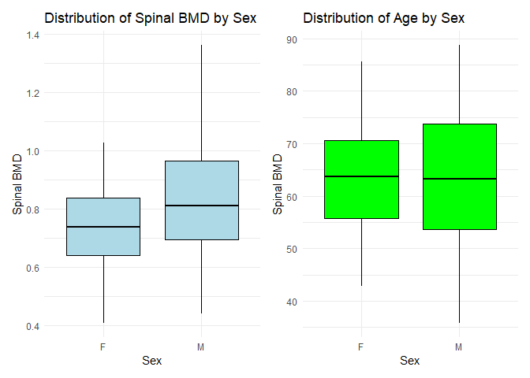
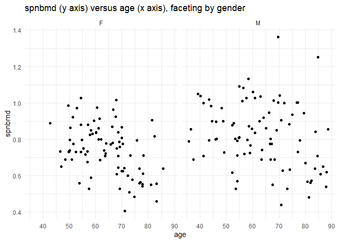
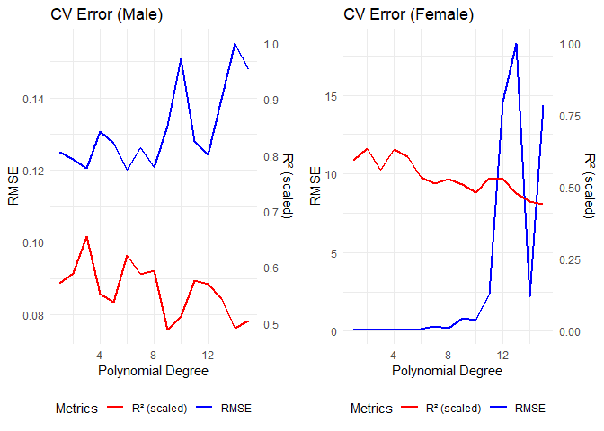
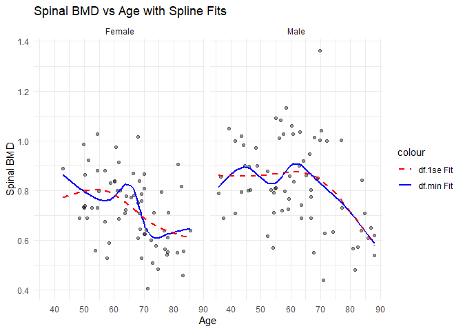
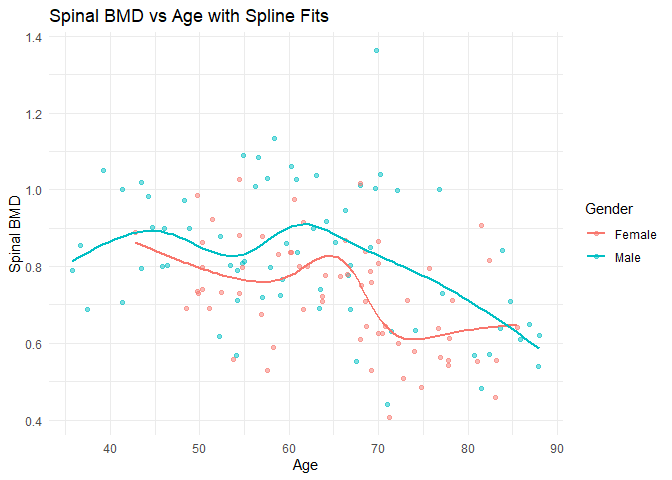
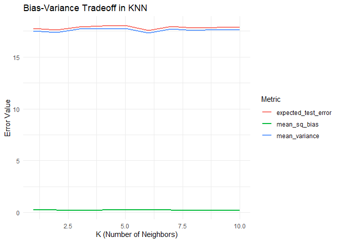
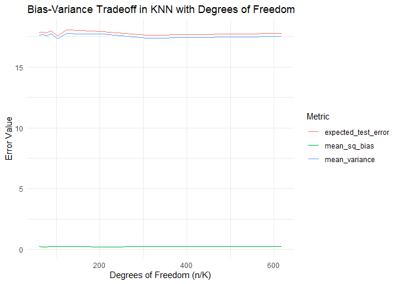

FA4 DATA MINING GONZALES
================
Dwight Gonzales
2025-03-09

``` r
library(tidyverse) # tidyverse
library(readxl) # for reading Excel files
library(knitr) # for include_graphics()
library(kableExtra) # for printing tables
library(cowplot) # for side by side plots
library(FNN) # for K-nearest-neighbors regression
library(patchwork)
library(caTools)
library(caret)
library(splines)  # Load splines package
library(gridExtra)
library(Metrics)  # For RMSE calculation

#Import data

df<-read_excel("C:\\Users\\DWIGHT JIRO\\Downloads\\bmd-data.xlsx",sheet=NULL,range=NULL)
bmd_raw<-as_tibble(df)

# Print the imported tibble
head(bmd_raw)
```

    ## # A tibble: 6 × 9
    ##   idnum   age sex   fracture  weight_kg height_cm medication waiting_time spnbmd
    ##   <dbl> <dbl> <chr> <chr>         <dbl>     <dbl> <chr>             <dbl>  <dbl>
    ## 1   469  57.1 F     no fract…        64      156. Anticonvu…           18  0.879
    ## 2  8724  75.7 F     no fract…        78      162  No medica…           56  0.795
    ## 3  6736  70.8 M     no fract…        73      170. No medica…           10  0.907
    ## 4 24180  78.2 F     no fract…        60      148  No medica…           14  0.711
    ## 5 17072  54.2 M     no fract…        55      161  No medica…           20  0.791
    ## 6  3806  77.2 M     no fract…        65      168  No medica…            7  0.730

The variables in data contains numeric except for the “Sex and fracture”
which is a categorial variable Or can be considered as Nominal
variables. The data is almost tidey but it just needs to be clean up to
ensure accuracy

``` r
#operation for tidy process

bmd_raw <- bmd_raw %>%
  mutate(fracture = ifelse(fracture == "no fracture", "no", "yes"))
bmd_raw <- bmd_raw %>%
  mutate(height_cm = as.numeric(height_cm))
bmd_raw <- bmd_raw %>%
  mutate(weight_kg = as.numeric(weight_kg))

#tidy data

head(bmd_raw)
```

    ## # A tibble: 6 × 9
    ##   idnum   age sex   fracture weight_kg height_cm medication  waiting_time spnbmd
    ##   <dbl> <dbl> <chr> <chr>        <dbl>     <dbl> <chr>              <dbl>  <dbl>
    ## 1   469  57.1 F     no              64      156. Anticonvul…           18  0.879
    ## 2  8724  75.7 F     no              78      162  No medicat…           56  0.795
    ## 3  6736  70.8 M     no              73      170. No medicat…           10  0.907
    ## 4 24180  78.2 F     no              60      148  No medicat…           14  0.711
    ## 5 17072  54.2 M     no              55      161  No medicat…           20  0.791
    ## 6  3806  77.2 M     no              65      168  No medicat…            7  0.730

``` r
#Exploring data

#Set children age to 1-12 years
children_count <- sum(bmd_raw$age >= 1 & bmd_raw$age <= 12)
cat("The number of children in our data set ranging from 1-12:", children_count)
```

    ## The number of children in our data set ranging from 1-12: 0

``` r
#What are the number of boys and girls?
bmd_raw %>% group_by(sex)%>%tally() 
```

    ## # A tibble: 2 × 2
    ##   sex       n
    ##   <chr> <int>
    ## 1 F        83
    ## 2 M        86

``` r
#Median_age for F and M
bmd_raw %>%
  group_by(sex) %>%
  summarise(median_age = median(age, na.rm = TRUE))
```

    ## # A tibble: 2 × 2
    ##   sex   median_age
    ##   <chr>      <dbl>
    ## 1 F           63.8
    ## 2 M           63.2

``` r
p1<-ggplot(bmd_raw, aes(x = sex, y = spnbmd)) + 
  geom_boxplot(fill = "lightblue", color = "black") +
  theme_minimal() +
  labs(title = "Distribution of Spinal BMD by Sex", x = "Sex", y = "Spinal BMD")

p2<-ggplot(bmd_raw, aes(x = sex, y = age)) + 
  geom_boxplot(fill = "green", color = "black") +
  theme_minimal() +
  labs(title = "Distribution of Age by Sex", x = "Sex", y = "Spinal BMD")

p1 + p2
```

<!-- -->

Are there apparent differences in either spnbmd or age between these two
groups?

- Males appear to have a higher Spinal BMD with a mean of approx 0.8
  compare to F
- Interms of age, Females tends to have a higher age means more older
  females are under the case of Spinal BMD

``` r
ggplot(data = bmd_raw, aes(age, spnbmd)) +
  geom_point() +
  labs(title = "spnbmd (y axis) versus age (x axis), faceting by gender",y = "spnbmd", x = "age") + 
  facet_grid( ~ sex ) +
  theme_minimal() 
```

<!-- -->

Spinal BMD (spnbmd) vs. Age:

There is a slight downward trend in spnbmd as age increases, suggesting
bone mineral density tends to decrease with age. The spread of points
suggests some variability, but overall, older individuals tend to have
lower BMD.

Comparison Between Sex (F vs. M):

The distribution for females (F) seems slightly more concentrated at
lower BMD values, especially for older individuals. Males (M) appear to
have a broader range of BMD values, with some higher values compared to
females.

``` r
set.seed(5)  
split <- sample.split(bmd_raw$spnbmd, SplitRatio = 0.8)
bmd_train <- subset(bmd_raw, split == TRUE)   # Training set (80%)
bmd_test <- subset(bmd_raw, split == FALSE) 
bmd_train
```

    ## # A tibble: 135 × 9
    ##    idnum   age sex   fracture weight_kg height_cm medication waiting_time spnbmd
    ##    <dbl> <dbl> <chr> <chr>        <dbl>     <dbl> <chr>             <dbl>  <dbl>
    ##  1   469  57.1 F     no              64      156. Anticonvu…           18  0.879
    ##  2  8724  75.7 F     no              78      162  No medica…           56  0.795
    ##  3 24180  78.2 F     no              60      148  No medica…           14  0.711
    ##  4 17072  54.2 M     no              55      161  No medica…           20  0.791
    ##  5  3806  77.2 M     no              65      168  No medica…            7  0.730
    ##  6 17106  56.2 M     no              77      159  No medica…           26  1.01 
    ##  7 23834  49.9 F     no              59      150  No medica…            9  0.731
    ##  8  2088  66.3 M     no              72      160. No medica…           10  0.947
    ##  9  5364  45.9 M     no              62      169  No medica…           12  0.802
    ## 10  8922  74.0 F     no              68      164  No medica…            5  0.579
    ## # ℹ 125 more rows

``` r
bmd_test
```

    ## # A tibble: 34 × 9
    ##    idnum   age sex   fracture weight_kg height_cm medication waiting_time spnbmd
    ##    <dbl> <dbl> <chr> <chr>        <dbl>     <dbl> <chr>             <dbl>  <dbl>
    ##  1  6736  70.8 M     no              73      170. No medica…           10  0.907
    ##  2  2454  68.4 M     no              64      167  Glucocort…            6  0.689
    ##  3  5288  40.2 M     no              66      165  No medica…            8  1.04 
    ##  4  8622  57.8 F     no              50      152  No medica…           21  0.825
    ##  5 23843  58.2 F     no              59      154  No medica…           10  0.850
    ##  6   688  77.2 M     no              69      166  Glucocort…            9  1.00 
    ##  7  5292  75.0 M     no              69      174. No medica…           22  0.936
    ##  8   342  66.6 F     no              60      153  No medica…           18  0.963
    ##  9 23912  67.7 F     no              56      150  No medica…            5  0.926
    ## 10    35  56.2 F     no              68      150. No medica…           18  0.717
    ## # ℹ 24 more rows

``` r
bmd_train_male <- bmd_train %>% filter(sex == "M")
bmd_train_female <- bmd_train %>% filter(sex == "F")

bmd_test_male <- bmd_test %>% filter(sex == "M")
bmd_test_female <- bmd_test %>% filter(sex == "F")

# Dropping column "sex" as it only contains one value and converting categorial columns to factors
bmd_train_male <- bmd_train_male %>% select(-sex)
bmd_train_male <- bmd_train_male %>%
  mutate(across(c(fracture, medication), as.factor))

bmd_train_female <- bmd_train_female %>% select(-sex)
bmd_train_female <- bmd_train_female %>%
  mutate(across(c(fracture, medication), as.factor))

summary(bmd_train_male)
```

    ##      idnum            age        fracture   weight_kg       height_cm    
    ##  Min.   :  191   Min.   :35.81   no :49   Min.   :39.00   Min.   :151.5  
    ##  1st Qu.: 2173   1st Qu.:53.13   yes:19   1st Qu.:58.50   1st Qu.:161.0  
    ##  Median : 5334   Median :60.53            Median :68.50   Median :166.0  
    ##  Mean   : 7448   Mean   :61.52            Mean   :68.01   Mean   :165.5  
    ##  3rd Qu.: 7790   3rd Qu.:69.85            3rd Qu.:76.25   3rd Qu.:169.0  
    ##  Max.   :24097   Max.   :88.02            Max.   :96.00   Max.   :177.0  
    ##            medication  waiting_time       spnbmd      
    ##  Anticonvulsant : 2   Min.   : 5.00   Min.   :0.4407  
    ##  Glucocorticoids: 9   1st Qu.: 9.00   1st Qu.:0.7032  
    ##  No medication  :57   Median :14.00   Median :0.8054  
    ##                       Mean   :18.59   Mean   :0.8256  
    ##                       3rd Qu.:23.00   3rd Qu.:0.9866  
    ##                       Max.   :73.00   Max.   :1.3624

``` r
set.seed(5)  
deg <- 1:15

formulas <- map(deg, ~ as.formula(paste0("spnbmd ~ poly(age, ", ., ") + height_cm + weight_kg + fracture + medication"))) #predictors

fit_and_evaluate <- function(data, formulas) {
  fits <- map(formulas, ~ train(.x, data = data, method = "lm", trControl = trainControl(method = "cv", number = 10)))
  
  tibble(
    degree = deg,
    rmse = map_dbl(fits, ~ min(.x$results$RMSE)),
    rsquare = map_dbl(fits, ~ max(.x$results$Rsquared))
  )
}

results_male <- fit_and_evaluate(bmd_train_male, formulas)
```

    ## Warning in predict.lm(modelFit, newdata): prediction from rank-deficient fit;
    ## attr(*, "non-estim") has doubtful cases

``` r
results_female <- fit_and_evaluate(bmd_train_female, formulas)

plot_results <- function(results, title) {
  ggplot(results, aes(x = degree)) +
    geom_line(aes(y = rmse, color = "RMSE"), size = 1) +
    geom_line(aes(y = rsquare * max(results$rmse), color = "R² (scaled)"), size = 1) +  # Scale R²
    scale_y_continuous(sec.axis = sec_axis(
      trans = ~ . / max(results$rmse),  
      name = "R² (scaled)"
    )) +
    scale_color_manual(
      name = "Metrics",
      values = c("RMSE" = "blue", "R² (scaled)" = "red")
    ) +
    labs(title = title, x = "Polynomial Degree", y = "RMSE") +
    theme_minimal() +
    theme(legend.position = "bottom")  # Move legend to bottom
}

grid.arrange(
  plot_results(results_male, "CV Error (Male)"),
  plot_results(results_female, "CV Error (Female)"),
  ncol = 2
)
```

    ## Warning: Using `size` aesthetic for lines was deprecated in ggplot2 3.4.0.
    ## ℹ Please use `linewidth` instead.
    ## This warning is displayed once every 8 hours.
    ## Call `lifecycle::last_lifecycle_warnings()` to see where this warning was
    ## generated.

    ## Warning: The `trans` argument of `sec_axis()` is deprecated as of ggplot2 3.5.0.
    ## ℹ Please use the `transform` argument instead.
    ## This warning is displayed once every 8 hours.
    ## Call `lifecycle::last_lifecycle_warnings()` to see where this warning was
    ## generated.

    ## Warning: Use of `results$rmse` is discouraged.
    ## ℹ Use `rmse` instead.
    ## Use of `results$rmse` is discouraged.
    ## ℹ Use `rmse` instead.

<!-- -->

``` r
best_male_df <- results_male$degree[which.min(results_male$rmse)]
best_female_df <- results_female$degree[which.min(results_female$rmse)]
best_male_df
```

    ## [1] 6

``` r
best_female_df
```

    ## [1] 2

``` r
# Compute standard error of RMSE from cross-validation
se_male <- sd(results_male$rmse) / sqrt(nrow(results_male))
se_female <- sd(results_female$rmse) / sqrt(nrow(results_female))

se_male
```

    ## [1] 0.002976968

``` r
se_female
```

    ## [1] 1.64481

``` r
 one_se_male_df <- min(results_male$degree[results_male$rmse <= min(results_male$rmse) + se_male])
one_se_female_df <- min(results_female$degree[results_female$rmse <= min(results_female$rmse) + se_female])

one_se_male_df
```

    ## [1] 3

``` r
one_se_female_df
```

    ## [1] 1

``` r
df.min <- max(best_male_df, best_female_df)  # Max of best df for both
df.1se <- max(one_se_male_df, one_se_female_df)  # Max of 1-SE df for both

spline_min_male <- lm(spnbmd ~ splines::ns(age, df = df.min), data = bmd_train_male)
spline_min_female <- lm(spnbmd ~ splines::ns(age, df = df.min), data = bmd_train_female)

spline_1se_male <- lm(spnbmd ~ splines::ns(age, df = df.1se), data = bmd_train_male)
spline_1se_female <- lm(spnbmd ~ splines::ns(age, df = df.1se), data = bmd_train_female)

bmd_train_male$fit_min <- predict(spline_min_male, newdata = bmd_train_male)
bmd_train_female$fit_min <- predict(spline_min_female, newdata = bmd_train_female)

bmd_train_male$fit_1se <- predict(spline_1se_male, newdata = bmd_train_male)
bmd_train_female$fit_1se <- predict(spline_1se_female, newdata = bmd_train_female)

# Merge datasets
bmd_plot_data <- bind_rows(
  bmd_train_male %>% mutate(gender = "Male"),
  bmd_train_female %>% mutate(gender = "Female")
)

# Plot
ggplot(bmd_plot_data, aes(x = age, y = spnbmd)) +
  geom_point(alpha = 0.4) +  
  geom_line(aes(y = fit_min, color = "df.min Fit"), linewidth = 1) +  
  geom_line(aes(y = fit_1se, color = "df.1se Fit"), linewidth = 1, linetype = "dashed") +  
  facet_wrap(~ gender) +  
  labs(title = "Spinal BMD vs Age with Spline Fits",
       x = "Age", y = "Spinal BMD") +
  scale_color_manual(values = c("df.min Fit" = "blue", "df.1se Fit" = "red")) +
  theme_minimal()
```

<!-- -->

df.1se (Red Dashed Line) is likely the better choice because spinal BMD
should change gradually with age. df.min (Blue Solid Line) is likely
overfitting, especially in the male group, where it picks up sharp
fluctuations.

``` r
#final spline models

final_model_male <- lm(spnbmd ~ ns(age, df = df.1se), data = bmd_train_male)
final_model_female <- lm(spnbmd ~ ns(age, df = df.1se), data = bmd_train_female)

summary(final_model_male)
```

    ## 
    ## Call:
    ## lm(formula = spnbmd ~ ns(age, df = df.1se), data = bmd_train_male)
    ## 
    ## Residuals:
    ##      Min       1Q   Median       3Q      Max 
    ## -0.39331 -0.10563 -0.01094  0.14096  0.51778 
    ## 
    ## Coefficients:
    ##                       Estimate Std. Error t value Pr(>|t|)    
    ## (Intercept)            0.85995    0.07509  11.452  < 2e-16 ***
    ## ns(age, df = df.1se)1  0.04087    0.08175   0.500 0.618793    
    ## ns(age, df = df.1se)2 -0.15804    0.17446  -0.906 0.368421    
    ## ns(age, df = df.1se)3 -0.27874    0.07049  -3.954 0.000195 ***
    ## ---
    ## Signif. codes:  0 '***' 0.001 '**' 0.01 '*' 0.05 '.' 0.1 ' ' 1
    ## 
    ## Residual standard error: 0.1636 on 64 degrees of freedom
    ## Multiple R-squared:  0.209,  Adjusted R-squared:  0.172 
    ## F-statistic: 5.638 on 3 and 64 DF,  p-value: 0.001715

``` r
summary(final_model_female)
```

    ## 
    ## Call:
    ## lm(formula = spnbmd ~ ns(age, df = df.1se), data = bmd_train_female)
    ## 
    ## Residuals:
    ##       Min        1Q    Median        3Q       Max 
    ## -0.272361 -0.076279 -0.005134  0.076714  0.307233 
    ## 
    ## Coefficients:
    ##                       Estimate Std. Error t value Pr(>|t|)    
    ## (Intercept)            0.77199    0.08271   9.333 1.72e-13 ***
    ## ns(age, df = df.1se)1 -0.14014    0.06176  -2.269  0.02670 *  
    ## ns(age, df = df.1se)2 -0.08974    0.19478  -0.461  0.64660    
    ## ns(age, df = df.1se)3 -0.19643    0.06778  -2.898  0.00516 ** 
    ## ---
    ## Signif. codes:  0 '***' 0.001 '**' 0.01 '*' 0.05 '.' 0.1 ' ' 1
    ## 
    ## Residual standard error: 0.1282 on 63 degrees of freedom
    ## Multiple R-squared:  0.2154, Adjusted R-squared:  0.178 
    ## F-statistic: 5.764 on 3 and 63 DF,  p-value: 0.001507

``` r
train_pred_male <- predict(final_model_male, newdata = bmd_train_male)
test_pred_male <- predict(final_model_male, newdata = bmd_test_male)

train_pred_female <- predict(final_model_female, newdata = bmd_train_female)
test_pred_female <- predict(final_model_female, newdata = bmd_test_female)

train_rmse_male <- rmse(bmd_train_male$spnbmd, train_pred_male)
test_rmse_male <- rmse(bmd_test_male$spnbmd, test_pred_male)

train_rmse_female <- rmse(bmd_train_female$spnbmd, train_pred_female)
test_rmse_female <- rmse(bmd_test_female$spnbmd, test_pred_female)

rmse_results <- tibble(
  Gender = c("Male", "Female"),
  Training_RMSE = c(train_rmse_male, train_rmse_female),
  Test_RMSE = c(test_rmse_male, test_rmse_female)
)

# Print RMSE results in a nice table
print(rmse_results)
```

    ## # A tibble: 2 × 3
    ##   Gender Training_RMSE Test_RMSE
    ##   <chr>          <dbl>     <dbl>
    ## 1 Male           0.159     0.223
    ## 2 Female         0.124     0.114

The male model shows mild overfitting, meaning it might have captured
some noise in the training data. The female model suggests a
well-regularized fit, as the performance on both training and test sets
is nearly the same.

``` r
bmd_train_male$gender <- "Male"
bmd_train_female$gender <- "Female"
bmd_train_combined <- bind_rows(bmd_train_male, bmd_train_female)

df_chosen <- max(df.min, df.1se)  # Use the selected degrees of freedom

spline_model <- lm(spnbmd ~ ns(age, df = df_chosen), data = bmd_train_combined)

bmd_train_combined <- bmd_train_combined %>%
  mutate(predicted = predict(spline_model, newdata = bmd_train_combined))

ggplot(bmd_train_combined, aes(x = age, y = spnbmd, color = gender)) +
  geom_point(alpha = 0.5) +  # Scatter points
  geom_smooth(method = "lm", formula = y ~ ns(x, df = df_chosen), se = FALSE) +  # Spline fit
  labs(title = "Spinal BMD vs Age with Spline Fits",
       x = "Age",
       y = "Spinal BMD",
       color = "Gender") +
  theme_minimal()
```

<!-- -->
2.1

Training error is the difference between the predicted and actual values
of a model on a training dataset. It means that if we set this rule ,
the training error will just be 0 since the prediction is exactly equal
to last year’s yield.

``` r
sigma_sq <- 16  # Variance of noise

# Bias squared (since E[Y_hat] = f(E), bias is 0)
bias_sq <- 0

# Variance of predictions
var_y_hat <- sigma_sq

# Expected Test Error
expected_test_error <- bias_sq + var_y_hat + sigma_sq

results <- data.frame(
  Metric = c("Mean Squared Bias", "Mean Variance", "Expected Test Error"),
  Value = c(bias_sq, var_y_hat, expected_test_error)
)

print(results)
```

    ##                Metric Value
    ## 1   Mean Squared Bias     0
    ## 2       Mean Variance    16
    ## 3 Expected Test Error    32

rule is simple but suboptimal because it: - retains noise from last
year - ignores the underlying pattern - Results in higher variance and
test error

If k increases the decision boundaries are less affected by individual
observations, which decreases model complexity. On the negative side, if
k increases too much it can cause underfitting, where the model is
unable to detect relationships within the data set.

df≈n/K makes sense because, in KNN, each prediction is based on an
average over, reducing the number of independent parameters.

Increasing the value of “K” in a K-Nearest Neighbors (KNN) algorithm
generally improves the prediction rule by decreasing variance at the
cost of slightly increasing bias; this aligns with the bias-variance
tradeoff, where a higher “K” leads to a more stable, less sensitive
model, making it less prone to fluctuations based on noisy data points,
but potentially sacrificing some accuracy by making predictions that are
more “average” and less specific to individual data points

When K is small the model is very flexible, leading to low bias but high
variance.

``` r
training_results_summary <- readRDS("C:\\Users\\DWIGHT JIRO\\Downloads\\training_results_summary.rds")
training_results_summary
```

    ## # A tibble: 6,174 × 5
    ##        K    X1    X2    bias variance
    ##    <dbl> <dbl> <dbl>   <dbl>    <dbl>
    ##  1     1     0     0 -0.25       16.2
    ##  2     1     0    10  0.14       12.2
    ##  3     1     0    20 -0.523      20.4
    ##  4     1     0    30  0.109      15.6
    ##  5     1     0    40 -0.566      21.4
    ##  6     1     0    50 -0.336      15.9
    ##  7     1     0    60 -1.04       12.4
    ##  8     1     0    70 -0.0213     12.4
    ##  9     1     0    80  0.045      18.3
    ## 10     1     0    90 -0.312      14.7
    ## # ℹ 6,164 more rows

``` r
# Compute overall results
overall_results <- training_results_summary %>%
  group_by(K) %>%
  summarise(
    mean_sq_bias = mean(bias^2, na.rm = TRUE),  
    mean_variance = mean(variance, na.rm = TRUE), 
    expected_test_error = mean(bias^2 + variance, na.rm = TRUE)  
    
  )

overall_results
```

    ## # A tibble: 10 × 4
    ##        K mean_sq_bias mean_variance expected_test_error
    ##    <dbl>        <dbl>         <dbl>               <dbl>
    ##  1     1        0.280          17.5                17.8
    ##  2     2        0.256          17.4                17.6
    ##  3     3        0.227          17.7                17.9
    ##  4     4        0.264          17.7                18.0
    ##  5     5        0.255          17.8                18.0
    ##  6     6        0.252          17.3                17.6
    ##  7     7        0.244          17.7                18.0
    ##  8     8        0.232          17.6                17.8
    ##  9     9        0.232          17.6                17.9
    ## 10    10        0.240          17.6                17.9

``` r
overall_results_long <- overall_results %>%
  pivot_longer(cols = c(mean_sq_bias, mean_variance, expected_test_error),
               names_to = "Metric", values_to = "Value")

overall_plot <- ggplot(overall_results_long, aes(x = K, y = Value, color = Metric)) +
  geom_line(size = 1) +  
  theme_minimal() +
  labs(title = "Bias-Variance Tradeoff in KNN",
       x = "K (Number of Neighbors)",
       y = "Error Value",
       color = "Metric")

overall_plot
```

<!-- -->

K should be ideally aroud 5.0 since that has the lowest expected test
error

When bias increases and variance decreases, it means a machine learning
model is becoming simpler and less flexible, essentially “underfitting”
the data by making overly generalized predictions, where it misses
important patterns in the data due to its simplified assumptions,
resulting in consistent but potentially inaccurate predictions across
different datasets; this is often caused by using a model that is too
basic for the complexity of the data.

The bump occurs because, at K=2, we are averaging over just one extra
tree, which may have a different yield due to small location-based
difference As 𝐾 increases further, we include more trees, reducing the
bias introduced at 𝐾=2 leading to a smoother and more accurate estimate
of the underlying trend.

``` r
# Find the row with the highest absolute bias
max_abs_bias_row <- training_results_summary %>%
  mutate(abs_bias = abs(bias)) %>%
  arrange(desc(abs_bias)) %>%
  slice(1)

max_abs_bias_row
```

    ## # A tibble: 1 × 6
    ##       K    X1    X2  bias variance abs_bias
    ##   <dbl> <dbl> <dbl> <dbl>    <dbl>    <dbl>
    ## 1     1     0    70 -2.06     13.9     2.06

``` r
n <- nrow(training_results_summary) / length(unique(training_results_summary$K))
overall_results <- training_results_summary %>%
  group_by(K) %>%
  summarise(
    mean_sq_bias = mean(bias^2),
    mean_variance = mean(variance),
    expected_test_error = mean(bias^2 + variance)
  ) %>%
  mutate(df = n / K)  # Compute degrees of freedom

plot_data <- overall_results %>%
  select(df, mean_sq_bias, mean_variance, expected_test_error) %>%
  pivot_longer(cols = -df, names_to = "Metric", values_to = "Error_Value")

ggplot(plot_data, aes(x = df, y = Error_Value, color = Metric)) +
  geom_line() +
  labs(
    title = "Bias-Variance Tradeoff in KNN with Degrees of Freedom",
    x = "Degrees of Freedom (n/K)",
    y = "Error Value"
  ) +
  theme_minimal()
```

<!-- -->
