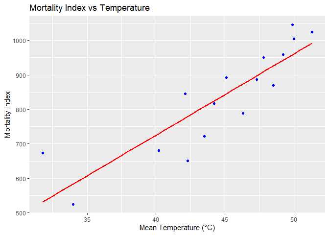
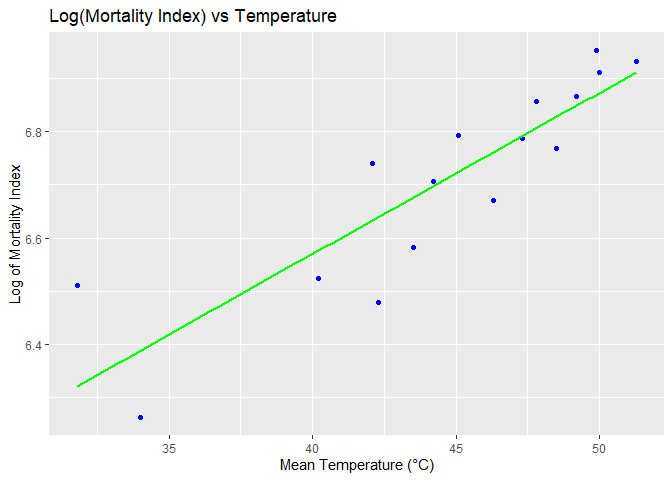
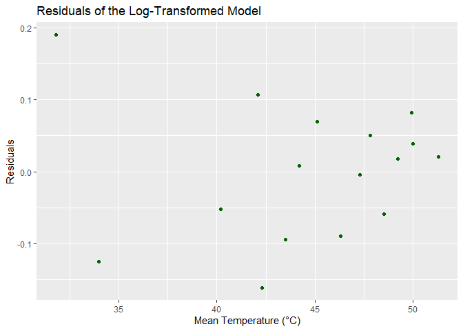
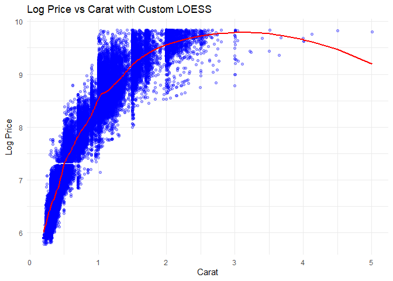
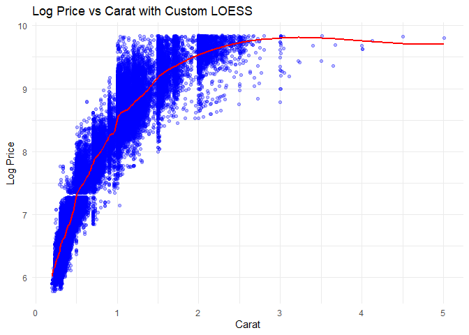
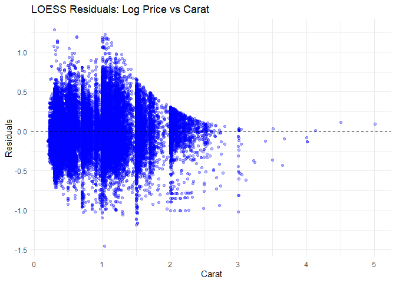
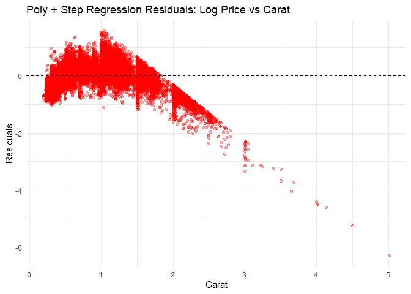

FA4_GONZALES_EDA
================
Dwight Gonzales
2025-03-07

``` r
df<-read.csv("C:\\Users\\DWIGHT JIRO\\Downloads\\mortality_by_latitude.csv")
head(df)
```

    ##   latitude mortality_index temperature
    ## 1       50            1025        51.3
    ## 2       51            1045        49.9
    ## 3       52            1004        50.0
    ## 4       53             959        49.2
    ## 5       54             870        48.5
    ## 6       55             950        47.8

``` r
library(ggplot2)

ggplot(df, aes(x = temperature, y = mortality_index)) + 
  geom_point(color = "blue") +
  geom_smooth(method = "lm", color = "red", se = FALSE) +
  labs(title = "Mortality Index vs Temperature",
       x = "Mean Temperature (°C)",
       y = "Mortality Index")
```

<!-- -->

``` r
df$log_mortality <- log(df$mortality_index)

ggplot(df, aes(x = temperature, y = log_mortality)) + 
  geom_point(color = "blue") +  # scatter plot
  geom_smooth(method = "lm", color = "green", se = FALSE) +  # regression line
  labs(title = "Log(Mortality Index) vs Temperature",
       x = "Mean Temperature (°C)", 
       y = "Log of Mortality Index")
```

<!-- -->

``` r
model_log <- lm(log_mortality ~ temperature, data = df)

summary(model_log)
```

    ## 
    ## Call:
    ## lm(formula = log_mortality ~ temperature, data = df)
    ## 
    ## Residuals:
    ##      Min       1Q   Median       3Q      Max 
    ## -0.16104 -0.06642  0.01310  0.05519  0.18985 
    ## 
    ## Coefficients:
    ##             Estimate Std. Error t value Pr(>|t|)    
    ## (Intercept) 5.359852   0.199090  26.922 1.85e-13 ***
    ## temperature 0.030253   0.004432   6.826 8.25e-06 ***
    ## ---
    ## Signif. codes:  0 '***' 0.001 '**' 0.01 '*' 0.05 '.' 0.1 ' ' 1
    ## 
    ## Residual standard error: 0.09584 on 14 degrees of freedom
    ## Multiple R-squared:  0.769,  Adjusted R-squared:  0.7524 
    ## F-statistic: 46.59 on 1 and 14 DF,  p-value: 8.246e-06

``` r
df$residuals <- residuals(model_log)

ggplot(df, aes(x = temperature, y = residuals)) +
  geom_point(color = "darkgreen") +
  labs(title = "Residuals of the Log-Transformed Model",
       x = "Mean Temperature (°C)",
       y = "Residuals") 
```

<!-- -->

``` r
data(diamonds)
diamonds$log_price <- log(diamonds$price)  # Create log-transformed price column


 #Span and Degree fitting test 

loess_model <- loess(log_price ~ carat, data = diamonds, span = 0.2, degree = 2)

diamonds$loess_fit <- predict(loess_model)

ggplot(diamonds, aes(x = carat, y = log_price)) +  
  geom_point(color = "blue", alpha = 0.3) +  
  geom_line(aes(y = loess_fit), color = "red", linewidth = 1) +  # Custom LOESS line
  labs(title = "Log Price vs Carat with Custom LOESS",
       x = "Carat",
       y = "Log Price") +
  theme_minimal()
```

<!-- -->

``` r
# Sample 2

loess_model <- loess(log_price ~ carat, data = diamonds, span = 0.1, degree = 1)
diamonds$loess_fit <- predict(loess_model)

sample2<-ggplot(diamonds, aes(x = carat, y = log_price)) +  
  geom_point(color = "blue", alpha = 0.3) +  
  geom_line(aes(y = loess_fit), color = "red", linewidth = 1) +  # Custom LOESS line
  labs(title = "Log Price vs Carat with Custom LOESS",
       x = "Carat",
       y = "Log Price") +
  theme_minimal()

sample2
```

<!-- -->

``` r
# Sample 3
loess_model <- loess(log_price ~ carat, data = diamonds, span = 0.1, degree = 0)
diamonds$loess_fit <- predict(loess_model)


ggplot(diamonds, aes(x = carat, y = log_price)) +  
  geom_point(color = "blue", alpha = 0.3) +  
  geom_line(aes(y = loess_fit), color = "red", linewidth = 1) +  # Custom LOESS line
  labs(title = "Log Price vs Carat with Custom LOESS",
       x = "Carat",
       y = "Log Price") +
  theme_minimal()
```

<!-- -->

After plotting different span and degree pointss, I would choose the
Sample 2 as the best fit.Since the model cpatures and matches our
datapoints

``` r
sample2
```

<!-- -->

``` r
loess_model <- loess(log_price ~ carat, data = diamonds, span = 0.1, degree = 1)
```

    ## Warning in simpleLoess(y, x, w, span, degree = degree, parametric = parametric,
    ## : pseudoinverse used at 0.31

    ## Warning in simpleLoess(y, x, w, span, degree = degree, parametric = parametric,
    ## : neighborhood radius 0.01

    ## Warning in simpleLoess(y, x, w, span, degree = degree, parametric = parametric,
    ## : reciprocal condition number 0

``` r
diamonds$loess_fit <- predict(loess_model)
diamonds$loess_resid <- residuals(loess_model)

# Residual plot
loess_residual <- ggplot(diamonds, aes(x = carat, y = loess_resid)) +  
  geom_point(color = "blue", alpha = 0.3) +  
  geom_hline(yintercept = 0, linetype = "dashed") +  # Add reference line at y=0
  labs(title = "LOESS Residuals: Log Price vs Carat",
       x = "Carat",
       y = "Residuals") +
  theme_minimal()

loess_residual
```

<!-- -->

``` r
poly_model <- lm(log_price ~ poly(carat, 1), data = diamonds)
step_model<-step(poly_model,direction = "both")
```

    ## Start:  AIC=-99613.15
    ## log_price ~ poly(carat, 1)
    ## 
    ##                  Df Sum of Sq   RSS    AIC
    ## <none>                         8508 -99613
    ## - poly(carat, 1)  1     47022 55531   1570

``` r
diamonds$poly_fit <- predict(step_model, newdata = diamonds)  
diamonds$poly_resid <- residuals(step_model)

poly_step_residual<-ggplot(diamonds, aes(x = carat, y = poly_resid)) +  
  geom_point(color = "red", alpha = 0.3) +  
  geom_hline(yintercept = 0, linetype = "dashed") +  
  labs(title = "Poly + Step Regression Residuals: Log Price vs Carat",
       x = "Carat",
       y = "Residuals") +
  theme_minimal()

poly_step_residual
```

<!-- -->

I would choose the Poly + Step Regression Residuals,since the Loess
method shows a pattern wherein the Poly + Step regression looks like a
random noise
