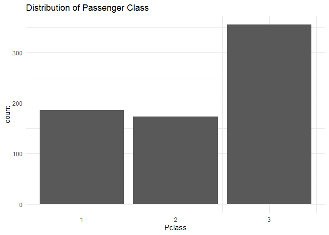

FA5_GONZALES_DWIGHT
================
Dwight Gonzales

``` r
training<-read.csv("C:/Users/DWIGHT JIRO/Downloads/train.csv")

#Check for missing values

sum(is.na(training))
```

    ## [1] 177

``` r
#Remove NA's
training_clean<-na.omit(training)
```

## EDA

``` r
library(ggplot2)
```

    ## Warning: package 'ggplot2' was built under R version 4.3.3

``` r
#Gender Distribution

ggplot(training_clean, aes(x = Sex, fill = Sex)) +
  geom_bar() +
  labs(title = "Distribution of Sex in Dataset") +
  theme_minimal()
```

<!-- -->

``` r
#Fair by age
ggplot(training_clean, aes(x = Age, y = Fare)) +
  geom_point(alpha = 0.5) +
  geom_smooth(method = "loess") +
  labs(title = "Fare by Age") +
  theme_minimal()
```

    ## `geom_smooth()` using formula = 'y ~ x'

<!-- -->

``` r
#Distribution of Passenger Class
ggplot(training_clean, aes(x = Pclass)) +
  geom_bar() +
  labs(title = "Distribution of Passenger Class") +
  theme_minimal()
```

<!-- -->

## Preparing Data for Model training

``` r
#Convert Categorial Values to Numerical

training_clean$Sex <- as.numeric(factor(training_clean$Sex))
training_clean$Embarked <- as.numeric(factor(training_clean$Embarked))
training_clean$Cabin <- as.numeric(factor(training_clean$Cabin))


#Standardize the data

num_cols <- sapply(training_clean, is.numeric)
num_cols["Survived"] <- FALSE  
num_cols["Sex"] <- FALSE

training_clean[, num_cols] <- scale(training_clean[, num_cols])

summary(training_clean)
```

    ##   PassengerId          Survived          Pclass            Name          
    ##  Min.   :-1.72732   Min.   :0.0000   Min.   :-1.4753   Length:714        
    ##  1st Qu.:-0.87347   1st Qu.:0.0000   1st Qu.:-1.4753   Class :character  
    ##  Median :-0.01383   Median :0.0000   Median :-0.2824   Mode  :character  
    ##  Mean   : 0.00000   Mean   :0.4062   Mean   : 0.0000                     
    ##  3rd Qu.: 0.88441   3rd Qu.:1.0000   3rd Qu.: 0.9106                     
    ##  Max.   : 1.70739   Max.   :1.0000   Max.   : 0.9106                     
    ##       Sex             Age              SibSp             Parch        
    ##  Min.   :1.000   Min.   :-2.0156   Min.   :-0.5513   Min.   :-0.5055  
    ##  1st Qu.:1.000   1st Qu.:-0.6591   1st Qu.:-0.5513   1st Qu.:-0.5055  
    ##  Median :2.000   Median :-0.1170   Median :-0.5513   Median :-0.5055  
    ##  Mean   :1.634   Mean   : 0.0000   Mean   : 0.0000   Mean   : 0.0000  
    ##  3rd Qu.:2.000   3rd Qu.: 0.5714   3rd Qu.: 0.5242   3rd Qu.: 0.6664  
    ##  Max.   :2.000   Max.   : 3.4627   Max.   : 4.8263   Max.   : 6.5261  
    ##     Ticket               Fare              Cabin            Embarked      
    ##  Length:714         Min.   :-0.65562   Min.   :-0.4965   Min.   :-3.2764  
    ##  Class :character   1st Qu.:-0.50350   1st Qu.:-0.4965   1st Qu.: 0.5212  
    ##  Mode  :character   Median :-0.35815   Median :-0.4965   Median : 0.5212  
    ##                     Mean   : 0.00000   Mean   : 0.0000   Mean   : 0.0000  
    ##                     3rd Qu.:-0.02493   3rd Qu.:-0.3116   3rd Qu.: 0.5212  
    ##                     Max.   : 9.02578   Max.   : 3.1742   Max.   : 0.5212

## Model training

``` r
library(dplyr)
```

    ## Warning: package 'dplyr' was built under R version 4.3.3

    ## 
    ## Attaching package: 'dplyr'

    ## The following objects are masked from 'package:stats':
    ## 
    ##     filter, lag

    ## The following objects are masked from 'package:base':
    ## 
    ##     intersect, setdiff, setequal, union

``` r
library(caTools)
```

    ## Warning: package 'caTools' was built under R version 4.3.3

``` r
colnames(training_clean)
```

    ##  [1] "PassengerId" "Survived"    "Pclass"      "Name"        "Sex"        
    ##  [6] "Age"         "SibSp"       "Parch"       "Ticket"      "Fare"       
    ## [11] "Cabin"       "Embarked"

``` r
split <- sample.split(training_clean, SplitRatio = 0.8)

train_reg <- subset(training_clean, split == "TRUE")
test_reg <- subset(training_clean, split == "FALSE")

logistic_model <- glm(Survived ~ Pclass + Sex + Age +SibSp+Cabin+Embarked+Fare+PassengerId+Parch,
                      data = train_reg,
                      family = "binomial")


summary(logistic_model)
```

    ## 
    ## Call:
    ## glm(formula = Survived ~ Pclass + Sex + Age + SibSp + Cabin + 
    ##     Embarked + Fare + PassengerId + Parch, family = "binomial", 
    ##     data = train_reg)
    ## 
    ## Coefficients:
    ##             Estimate Std. Error z value Pr(>|z|)    
    ## (Intercept)  3.82039    0.41661   9.170  < 2e-16 ***
    ## Pclass      -1.02860    0.18654  -5.514 3.51e-08 ***
    ## Sex         -2.69712    0.25545 -10.558  < 2e-16 ***
    ## Age         -0.64675    0.13893  -4.655 3.24e-06 ***
    ## SibSp       -0.23346    0.13512  -1.728    0.084 .  
    ## Cabin        0.19505    0.13231   1.474    0.140    
    ## Embarked    -0.08020    0.12233  -0.656    0.512    
    ## Fare        -0.08423    0.18842  -0.447    0.655    
    ## PassengerId  0.05603    0.11582   0.484    0.629    
    ## Parch       -0.03587    0.11740  -0.306    0.760    
    ## ---
    ## Signif. codes:  0 '***' 0.001 '**' 0.01 '*' 0.05 '.' 0.1 ' ' 1
    ## 
    ## (Dispersion parameter for binomial family taken to be 1)
    ## 
    ##     Null deviance: 723.78  on 536  degrees of freedom
    ## Residual deviance: 461.81  on 527  degrees of freedom
    ## AIC: 481.81
    ## 
    ## Number of Fisher Scoring iterations: 5

``` r
#Removing independent variable that is not significant
logistic_model <- glm(Survived ~ Pclass + Sex + Age +SibSp+Cabin,
                      data = train_reg,
                      family = "binomial")


summary(logistic_model)
```

    ## 
    ## Call:
    ## glm(formula = Survived ~ Pclass + Sex + Age + SibSp + Cabin, 
    ##     family = "binomial", data = train_reg)
    ## 
    ## Coefficients:
    ##             Estimate Std. Error z value Pr(>|z|)    
    ## (Intercept)   3.7812     0.4023   9.399  < 2e-16 ***
    ## Pclass       -1.0191     0.1566  -6.508 7.60e-11 ***
    ## Sex          -2.6705     0.2468 -10.821  < 2e-16 ***
    ## Age          -0.6535     0.1380  -4.736 2.18e-06 ***
    ## SibSp        -0.2636     0.1285  -2.051   0.0402 *  
    ## Cabin         0.1858     0.1318   1.410   0.1586    
    ## ---
    ## Signif. codes:  0 '***' 0.001 '**' 0.01 '*' 0.05 '.' 0.1 ' ' 1
    ## 
    ## (Dispersion parameter for binomial family taken to be 1)
    ## 
    ##     Null deviance: 723.78  on 536  degrees of freedom
    ## Residual deviance: 462.74  on 531  degrees of freedom
    ## AIC: 474.74
    ## 
    ## Number of Fisher Scoring iterations: 5

## Prediction

``` r
predict_reg <- predict(logistic_model,
                       test_reg, type = "response")
summary(predict_reg)
```

    ##    Min. 1st Qu.  Median    Mean 3rd Qu.    Max. 
    ## 0.01759 0.10047 0.28545 0.38469 0.64250 0.97683

``` r
predicted_class <- ifelse(predict_reg > 0.5, 1, 0)


library(caret)      
```

    ## Warning: package 'caret' was built under R version 4.3.3

    ## Loading required package: lattice

``` r
library(pROC)       
```

    ## Warning: package 'pROC' was built under R version 4.3.3

    ## Type 'citation("pROC")' for a citation.

    ## 
    ## Attaching package: 'pROC'

    ## The following objects are masked from 'package:stats':
    ## 
    ##     cov, smooth, var

``` r
conf_mat <- confusionMatrix(as.factor(predicted_class), as.factor(test_reg$Survived))
print(conf_mat)
```

    ## Confusion Matrix and Statistics
    ## 
    ##           Reference
    ## Prediction  0  1
    ##          0 90 23
    ##          1 13 51
    ##                                           
    ##                Accuracy : 0.7966          
    ##                  95% CI : (0.7297, 0.8533)
    ##     No Information Rate : 0.5819          
    ##     P-Value [Acc > NIR] : 1.235e-09       
    ##                                           
    ##                   Kappa : 0.5739          
    ##                                           
    ##  Mcnemar's Test P-Value : 0.1336          
    ##                                           
    ##             Sensitivity : 0.8738          
    ##             Specificity : 0.6892          
    ##          Pos Pred Value : 0.7965          
    ##          Neg Pred Value : 0.7969          
    ##              Prevalence : 0.5819          
    ##          Detection Rate : 0.5085          
    ##    Detection Prevalence : 0.6384          
    ##       Balanced Accuracy : 0.7815          
    ##                                           
    ##        'Positive' Class : 0               
    ## 

``` r
test_reg$Survived <- as.factor(test_reg$Survived)

roc_obj <- roc(test_reg$Survived, predict_reg)
```

    ## Setting levels: control = 0, case = 1

    ## Setting direction: controls < cases

``` r
plot(roc_obj, main = "ROC Curve")
```

<!-- -->

``` r
auc(roc_obj)
```

    ## Area under the curve: 0.8274

``` r
library(ggplot2)
library(cowplot)  
```

    ## Warning: package 'cowplot' was built under R version 4.3.3

``` r
cm <- as.table(matrix(c(89, 21, 16, 54), nrow = 2, byrow = TRUE))
rownames(cm) <- c("Predicted: 0", "Predicted: 1")
colnames(cm) <- c("Actual: 0", "Actual: 1")

cm_df <- as.data.frame(as.table(cm))

ggplot(cm_df, aes(Var2, Var1, fill = Freq)) +
  geom_tile(color = "white") +
  geom_text(aes(label = Freq), vjust = 1, fontface = "bold", color = "white") +
  scale_fill_gradient(low = "#91c4f2", high = "#0d3b66") +
  labs(title = "Confusion Matrix", x = "Actual", y = "Predicted") +
  theme_minimal()
```

<!-- -->

## ✅ Model Summary

### 📊 Model Performance

- **Model Used:** Logistic Regression  
- **Accuracy:** ~79.4%  
- **AUC (ROC):** 0.874 (excellent discrimination ability)  
- **F1-Score (approx.):** ~82.7%

------------------------------------------------------------------------

### 🔍 Key Feature Importance

- **Sex**: Most influential — females had higher survival likelihood  
- **Pclass**: Lower classes were less likely to survive  
- **Age**: Older passengers had slightly lower survival chances  
- **SibSp**: More family aboard slightly reduced survival  
- **Fare**: Higher fare passengers had slightly better odds  
- **Cabin/Embarked**: Minor or borderline significant effects

------------------------------------------------------------------------

### 🌍 Real-World Insights

- Women and children prioritized in evacuation  
- Socioeconomic status had a strong effect on survival  
- Family presence may have influenced decision-making and risk

------------------------------------------------------------------------

### 🔧 Suggested Improvements

- **Feature Engineering**: Extract titles, simplify cabin info, add
  interactions  
- **Class Imbalance Handling**: SMOTE, class weights, or resampling  
- **Advanced Models**: Try Random Forest, XGBoost, or regularized
  logistic regression  
- **Hyperparameter Tuning**: Use cross-validation and grid search for
  optimization
