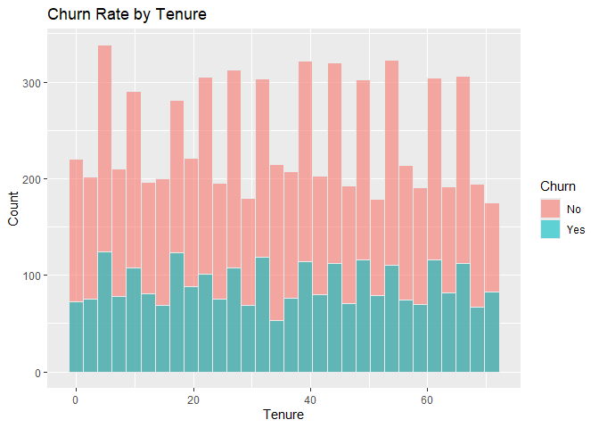
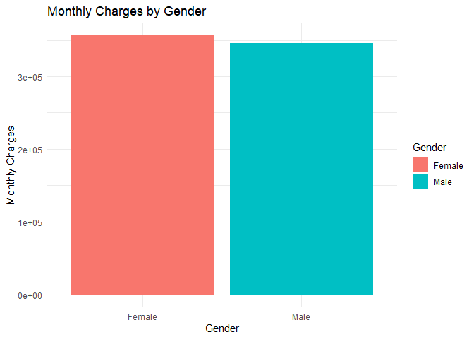
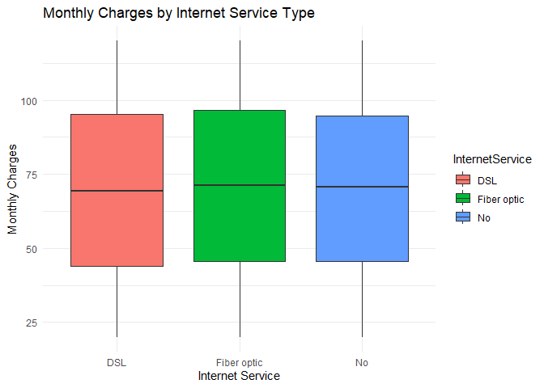
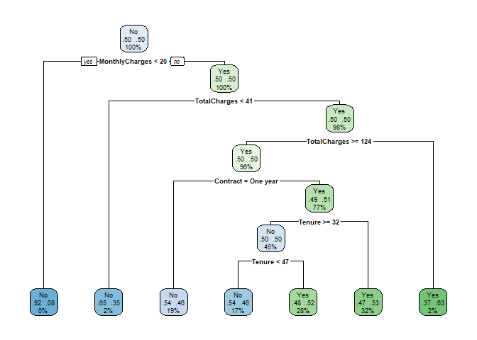

SA1 DSC1107
================
Dwight Gonzales
2025-03-19

``` r
library(ggplot2)
library(dplyr)
library(rpart)
library(caret)
library(rpart.plot)
library(caTools)
library(ROCR)
library(randomForest)
library(glmnet)
```

Untit 1

``` r
df <- read.csv("C:\\Users\\DWIGHT JIRO\\Downloads\\customer_churn.csv")
head(df)
```

    ##   CustomerID Gender SeniorCitizen Partner Dependents Tenure PhoneService
    ## 1  CUST00001   Male             0      No         No     65          Yes
    ## 2  CUST00002   Male             0      No         No     26          Yes
    ## 3  CUST00003   Male             0     Yes         No     54          Yes
    ## 4  CUST00004 Female             0     Yes        Yes     70          Yes
    ## 5  CUST00005   Male             0      No         No     53          Yes
    ## 6  CUST00006 Female             0      No        Yes     45          Yes
    ##   InternetService       Contract MonthlyCharges TotalCharges Churn
    ## 1     Fiber optic Month-to-month          20.04      1302.60    No
    ## 2     Fiber optic Month-to-month          65.14      1693.64    No
    ## 3     Fiber optic Month-to-month          49.38      2666.52    No
    ## 4             DSL       One year          31.19      2183.30    No
    ## 5             DSL Month-to-month         103.86      5504.58   Yes
    ## 6     Fiber optic Month-to-month          87.34      3930.30   Yes

``` r
summary(df)
```

    ##   CustomerID           Gender          SeniorCitizen      Partner         
    ##  Length:10000       Length:10000       Min.   :0.0000   Length:10000      
    ##  Class :character   Class :character   1st Qu.:0.0000   Class :character  
    ##  Mode  :character   Mode  :character   Median :0.0000   Mode  :character  
    ##                                        Mean   :0.1502                     
    ##                                        3rd Qu.:0.0000                     
    ##                                        Max.   :1.0000                     
    ##   Dependents            Tenure      PhoneService       InternetService   
    ##  Length:10000       Min.   : 0.00   Length:10000       Length:10000      
    ##  Class :character   1st Qu.:17.00   Class :character   Class :character  
    ##  Mode  :character   Median :35.00   Mode  :character   Mode  :character  
    ##                     Mean   :35.22                                        
    ##                     3rd Qu.:53.00                                        
    ##                     Max.   :71.00                                        
    ##    Contract         MonthlyCharges    TotalCharges       Churn          
    ##  Length:10000       Min.   : 20.02   Min.   :   0.0   Length:10000      
    ##  Class :character   1st Qu.: 44.88   1st Qu.: 961.2   Class :character  
    ##  Mode  :character   Median : 70.56   Median :2025.6   Mode  :character  
    ##                     Mean   : 70.18   Mean   :2455.8                     
    ##                     3rd Qu.: 95.77   3rd Qu.:3611.0                     
    ##                     Max.   :119.99   Max.   :8425.6

``` r
paste("NA values:", sum(is.na(df)))
```

    ## [1] "NA values: 0"

``` r
sapply(df, class)
```

    ##      CustomerID          Gender   SeniorCitizen         Partner      Dependents 
    ##     "character"     "character"       "integer"     "character"     "character" 
    ##          Tenure    PhoneService InternetService        Contract  MonthlyCharges 
    ##       "integer"     "character"     "character"     "character"       "numeric" 
    ##    TotalCharges           Churn 
    ##       "numeric"     "character"

``` r
paste("Rows:", nrow(df), "Columns:", ncol(df))
```

    ## [1] "Rows: 10000 Columns: 12"

Data mining is important as it allows organizations to discover hidden
patterns, trends, and valuable insights from large datasets, leading to
better decision-making, improved processes, and a competitive edge

``` r
ggplot(df, aes(x = Tenure, fill = Churn)) +
  geom_histogram( color="#e9ecef", alpha=0.6, position = 'identity') +
  labs(title = "Churn Rate by Tenure", x = "Tenure", y = "Count") 
```

    ## `stat_bin()` using `bins = 30`. Pick better value with `binwidth`.

<!-- -->

``` r
df %>%
  ggplot(aes(x = Gender, y = MonthlyCharges, fill = Gender)) +
  geom_col() +
  labs(title = "Monthly Charges by Gender", x = "Gender", y = "Monthly Charges") +
  theme_minimal()
```

<!-- -->

``` r
df %>%
  ggplot(aes(x = InternetService, y = MonthlyCharges, fill = InternetService)) +
  geom_boxplot() +
  labs(title = "Monthly Charges by Internet Service Type", x = "Internet Service", y = "Monthly Charges") +
  theme_minimal()
```

<!-- -->

``` r
df<-na.omit(df) #Handle missing values appropriately.

df <- df %>%
  mutate(across(c(CustomerID,Gender,Partner,SeniorCitizen, Dependents, PhoneService, 
                  InternetService, Contract, Churn), as.factor)) #Convert categorical variables into factor variables.


str(df)
```

    ## 'data.frame':    10000 obs. of  12 variables:
    ##  $ CustomerID     : Factor w/ 10000 levels "CUST00001","CUST00002",..: 1 2 3 4 5 6 7 8 9 10 ...
    ##  $ Gender         : Factor w/ 2 levels "Female","Male": 2 2 2 1 2 1 1 1 1 1 ...
    ##  $ SeniorCitizen  : Factor w/ 2 levels "0","1": 1 1 1 1 1 1 1 1 1 1 ...
    ##  $ Partner        : Factor w/ 2 levels "No","Yes": 1 1 2 2 1 1 2 2 2 1 ...
    ##  $ Dependents     : Factor w/ 2 levels "No","Yes": 1 1 1 2 1 2 1 2 2 1 ...
    ##  $ Tenure         : int  65 26 54 70 53 45 35 20 48 33 ...
    ##  $ PhoneService   : Factor w/ 2 levels "No","Yes": 2 2 2 2 2 2 2 2 1 2 ...
    ##  $ InternetService: Factor w/ 3 levels "DSL","Fiber optic",..: 2 2 2 1 1 2 3 2 3 3 ...
    ##  $ Contract       : Factor w/ 3 levels "Month-to-month",..: 1 1 1 2 1 1 2 1 1 3 ...
    ##  $ MonthlyCharges : num  20 65.1 49.4 31.2 103.9 ...
    ##  $ TotalCharges   : num  1303 1694 2667 2183 5505 ...
    ##  $ Churn          : Factor w/ 2 levels "No","Yes": 1 1 1 1 2 2 2 2 1 1 ...

``` r
df <- df %>%  #Filter data to remove outliers.
  filter(
    Tenure >= quantile(Tenure, 0.25) - 1.5 * IQR(Tenure) & Tenure <= quantile(Tenure, 0.75) + 1.5 * IQR(Tenure),
    MonthlyCharges >= quantile(MonthlyCharges, 0.25) - 1.5 * IQR(MonthlyCharges) & 
      MonthlyCharges <= quantile(MonthlyCharges, 0.75) + 1.5 * IQR(MonthlyCharges),
    TotalCharges >= quantile(TotalCharges, 0.25) - 1.5 * IQR(TotalCharges) & 
      TotalCharges <= quantile(TotalCharges, 0.75) + 1.5 * IQR(TotalCharges)
  )


cat("Filtered size:", nrow(df), "rows\n")
```

    ## Filtered size: 9928 rows

``` r
df <- df %>%
  mutate(HasInternetAndPhone = ifelse(InternetService != "No" & PhoneService == "Yes", 1, 0))


df %>%
  group_by(Tenure) %>%
  summarise(
    Count = n(),
    Avg_Monthly_Charges = mean(MonthlyCharges, na.rm = TRUE),
    Churn_Rate = mean(as.numeric(Churn == "Yes"))
  )
```

    ## # A tibble: 72 × 4
    ##    Tenure Count Avg_Monthly_Charges Churn_Rate
    ##     <int> <int>               <dbl>      <dbl>
    ##  1      0   136                72.1      0.199
    ##  2      1   157                67.9      0.293
    ##  3      2   146                72.2      0.240
    ##  4      3   131                67.8      0.305
    ##  5      4   170                68.9      0.265
    ##  6      5   153                68.5      0.255
    ##  7      6   139                69.7      0.288
    ##  8      7   128                71.9      0.266
    ##  9      8   160                74.0      0.275
    ## 10      9   125                68.8      0.288
    ## # ℹ 62 more rows

``` r
df %>%
  group_by(Tenure, Churn) %>%
  summarise(Count = n(), .groups = 'drop')
```

    ## # A tibble: 144 × 3
    ##    Tenure Churn Count
    ##     <int> <fct> <int>
    ##  1      0 No      109
    ##  2      0 Yes      27
    ##  3      1 No      111
    ##  4      1 Yes      46
    ##  5      2 No      111
    ##  6      2 Yes      35
    ##  7      3 No       91
    ##  8      3 Yes      40
    ##  9      4 No      125
    ## 10      4 Yes      45
    ## # ℹ 134 more rows

There are few outliers in the data as the dimension of data was reduced
after removing outliers.EDA also provides us the necessary information
for us to set up for our model that we will be using below

``` r
set.seed(123)
train_index <- createDataPartition(df$Churn, p = 0.8, list = FALSE)
train_data <- df[train_index, ]
test_data <- df[-train_index, ]


tree_model <- rpart(Churn ~  Tenure + MonthlyCharges + TotalCharges + Contract + SeniorCitizen, 
                    data = train_data, 
                    method = "class",  # For classification
                    control = rpart.control(minsplit = 10, cp = 0.01))

rpart.plot(tree_model, box.palette = "auto", nn = TRUE)
```

<!-- -->

Imbalanced Data since our data contains more “No” in large scale

``` r
table(df$Churn)  
```

    ## 
    ##   No  Yes 
    ## 7237 2691

``` r
df_balanced <- downSample(x = df[, -which(names(df) == "Churn")],  #balancing
                          y = df$Churn)

table(df_balanced$Class)  
```

    ## 
    ##   No  Yes 
    ## 2691 2691

``` r
colnames(df_balanced)[ncol(df_balanced)] <- "Churn"
table(df_balanced$Churn) 
```

    ## 
    ##   No  Yes 
    ## 2691 2691

After balancing, we can run the model again for decision tree

``` r
set.seed(123)  
train_index <- createDataPartition(df_balanced$Churn, p = 0.8, list = FALSE)
train_data <- df_balanced[train_index, ]
test_data  <- df_balanced[-train_index, ]


tree_model <- rpart(Churn ~  Tenure + MonthlyCharges + TotalCharges + Contract + SeniorCitizen, 
                    data = train_data, 
                    method = "class",  
                    control = rpart.control(minsplit = 10, cp = 0.01))

par(mar = c(1, 1, 1, 1))  # Reduce margin size
rpart.plot(tree_model, type = 2, extra = 104)
```

<!-- -->

``` r
df_balanced$Churn <- as.factor(df_balanced$Churn)
```

logistic regression model

``` r
set.seed(123)  
train_index <- createDataPartition(df_balanced$Churn, p = 0.8, list = FALSE)
train_data <- df_balanced[train_index, ]
test_data  <- df_balanced[-train_index, ]


logistic_model <- glm(Churn ~  Tenure + MonthlyCharges + TotalCharges + Contract + SeniorCitizen,
                      data = train_data,
                      family = "binomial")


pred_prob <- predict(logistic_model, test_data, type = "response")
pred_class <- ifelse(pred_prob > 0.5, "Yes", "No")
pred_class <- factor(pred_class, levels = c("No", "Yes"))

confusion_matrix <- confusionMatrix(pred_class, test_data$Churn)
confusion_matrix
```

    ## Confusion Matrix and Statistics
    ## 
    ##           Reference
    ## Prediction  No Yes
    ##        No  187 209
    ##        Yes 351 329
    ##                                           
    ##                Accuracy : 0.4796          
    ##                  95% CI : (0.4493, 0.5099)
    ##     No Information Rate : 0.5             
    ##     P-Value [Acc > NIR] : 0.915           
    ##                                           
    ##                   Kappa : -0.0409         
    ##                                           
    ##  Mcnemar's Test P-Value : 2.548e-09       
    ##                                           
    ##             Sensitivity : 0.3476          
    ##             Specificity : 0.6115          
    ##          Pos Pred Value : 0.4722          
    ##          Neg Pred Value : 0.4838          
    ##              Prevalence : 0.5000          
    ##          Detection Rate : 0.1738          
    ##    Detection Prevalence : 0.3680          
    ##       Balanced Accuracy : 0.4796          
    ##                                           
    ##        'Positive' Class : No              
    ## 

``` r
summary(logistic_model)
```

    ## 
    ## Call:
    ## glm(formula = Churn ~ Tenure + MonthlyCharges + TotalCharges + 
    ##     Contract + SeniorCitizen, family = "binomial", data = train_data)
    ## 
    ## Coefficients:
    ##                    Estimate Std. Error z value Pr(>|z|)   
    ## (Intercept)       4.358e-02  1.625e-01   0.268  0.78859   
    ## Tenure            1.314e-03  3.843e-03   0.342  0.73241   
    ## MonthlyCharges    2.400e-04  2.125e-03   0.113  0.91008   
    ## TotalCharges     -2.232e-05  5.198e-05  -0.429  0.66765   
    ## ContractOne year -2.108e-01  7.963e-02  -2.647  0.00811 **
    ## ContractTwo year -7.917e-02  7.769e-02  -1.019  0.30822   
    ## SeniorCitizen1    3.402e-02  8.563e-02   0.397  0.69117   
    ## ---
    ## Signif. codes:  0 '***' 0.001 '**' 0.01 '*' 0.05 '.' 0.1 ' ' 1
    ## 
    ## (Dispersion parameter for binomial family taken to be 1)
    ## 
    ##     Null deviance: 5969.4  on 4305  degrees of freedom
    ## Residual deviance: 5961.6  on 4299  degrees of freedom
    ## AIC: 5975.6
    ## 
    ## Number of Fisher Scoring iterations: 3

``` r
summary(tree_model)
```

    ## Call:
    ## rpart(formula = Churn ~ Tenure + MonthlyCharges + TotalCharges + 
    ##     Contract + SeniorCitizen, data = train_data, method = "class", 
    ##     control = rpart.control(minsplit = 10, cp = 0.01))
    ##   n= 4306 
    ## 
    ##           CP nsplit rel error   xerror       xstd
    ## 1 0.01079889      0 1.0000000 1.032048 0.01523140
    ## 2 0.01000000      6 0.9294008 1.020437 0.01523605
    ## 
    ## Variable importance
    ##         Tenure   TotalCharges MonthlyCharges       Contract 
    ##             36             32             19             12 
    ## 
    ## Node number 1: 4306 observations,    complexity param=0.01079889
    ##   predicted class=No   expected loss=0.5  P(node) =1
    ##     class counts:  2153  2153
    ##    probabilities: 0.500 0.500 
    ##   left son=2 (13 obs) right son=3 (4293 obs)
    ##   Primary splits:
    ##       MonthlyCharges < 20.28    to the left,  improve=4.66793900, (0 missing)
    ##       TotalCharges   < 40.955   to the left,  improve=3.34306200, (0 missing)
    ##       Contract       splits as  RLR,          improve=3.02352800, (0 missing)
    ##       Tenure         < 0.5      to the left,  improve=2.40047400, (0 missing)
    ##       SeniorCitizen  splits as  LR,           improve=0.07404251, (0 missing)
    ## 
    ## Node number 2: 13 observations
    ##   predicted class=No   expected loss=0.07692308  P(node) =0.003019043
    ##     class counts:    12     1
    ##    probabilities: 0.923 0.077 
    ## 
    ## Node number 3: 4293 observations,    complexity param=0.01079889
    ##   predicted class=Yes  expected loss=0.4987188  P(node) =0.996981
    ##     class counts:  2141  2152
    ##    probabilities: 0.499 0.501 
    ##   left son=6 (66 obs) right son=7 (4227 obs)
    ##   Primary splits:
    ##       TotalCharges   < 40.955   to the left,  improve=3.12988400, (0 missing)
    ##       Contract       splits as  RLR,          improve=2.95386200, (0 missing)
    ##       Tenure         < 0.5      to the left,  improve=2.44226500, (0 missing)
    ##       MonthlyCharges < 31.935   to the right, improve=1.76977000, (0 missing)
    ##       SeniorCitizen  splits as  LR,           improve=0.06392586, (0 missing)
    ##   Surrogate splits:
    ##       Tenure < 0.5      to the left,  agree=0.997, adj=0.818, (0 split)
    ## 
    ## Node number 6: 66 observations
    ##   predicted class=No   expected loss=0.3484848  P(node) =0.01532745
    ##     class counts:    43    23
    ##    probabilities: 0.652 0.348 
    ## 
    ## Node number 7: 4227 observations,    complexity param=0.01079889
    ##   predicted class=Yes  expected loss=0.4963331  P(node) =0.9816535
    ##     class counts:  2098  2129
    ##    probabilities: 0.496 0.504 
    ##   left son=14 (4123 obs) right son=15 (104 obs)
    ##   Primary splits:
    ##       TotalCharges   < 124.285  to the right, improve=3.6566480, (0 missing)
    ##       Contract       splits as  RLR,          improve=2.8028730, (0 missing)
    ##       MonthlyCharges < 31.935   to the right, improve=2.3058620, (0 missing)
    ##       Tenure         < 1.5      to the right, improve=1.9625700, (0 missing)
    ##       SeniorCitizen  splits as  LR,           improve=0.1653645, (0 missing)
    ##   Surrogate splits:
    ##       Tenure < 1.5      to the right, agree=0.987, adj=0.462, (0 split)
    ## 
    ## Node number 14: 4123 observations,    complexity param=0.01079889
    ##   predicted class=Yes  expected loss=0.4996362  P(node) =0.9575012
    ##     class counts:  2060  2063
    ##    probabilities: 0.500 0.500 
    ##   left son=28 (814 obs) right son=29 (3309 obs)
    ##   Primary splits:
    ##       Contract       splits as  RLR,          improve=2.99849800, (0 missing)
    ##       TotalCharges   < 7359.715 to the right, improve=2.39879700, (0 missing)
    ##       MonthlyCharges < 31.935   to the right, improve=1.81352500, (0 missing)
    ##       Tenure         < 68.5     to the left,  improve=1.61457900, (0 missing)
    ##       SeniorCitizen  splits as  LR,           improve=0.04089863, (0 missing)
    ##   Surrogate splits:
    ##       TotalCharges < 7527.56  to the right, agree=0.803, adj=0.004, (0 split)
    ## 
    ## Node number 15: 104 observations
    ##   predicted class=Yes  expected loss=0.3653846  P(node) =0.02415235
    ##     class counts:    38    66
    ##    probabilities: 0.365 0.635 
    ## 
    ## Node number 28: 814 observations
    ##   predicted class=No   expected loss=0.4619165  P(node) =0.1890386
    ##     class counts:   438   376
    ##    probabilities: 0.538 0.462 
    ## 
    ## Node number 29: 3309 observations,    complexity param=0.01079889
    ##   predicted class=Yes  expected loss=0.4901783  P(node) =0.7684626
    ##     class counts:  1622  1687
    ##    probabilities: 0.490 0.510 
    ##   left son=58 (1943 obs) right son=59 (1366 obs)
    ##   Primary splits:
    ##       Tenure         < 31.5     to the right, improve=1.50692900, (0 missing)
    ##       TotalCharges   < 7325.595 to the right, improve=1.41225100, (0 missing)
    ##       MonthlyCharges < 23.26    to the left,  improve=1.23546900, (0 missing)
    ##       Contract       splits as  R-L,          improve=0.48439640, (0 missing)
    ##       SeniorCitizen  splits as  LR,           improve=0.02341601, (0 missing)
    ##   Surrogate splits:
    ##       TotalCharges   < 1407.96  to the right, agree=0.820, adj=0.565, (0 split)
    ##       MonthlyCharges < 114.905  to the left,  agree=0.593, adj=0.014, (0 split)
    ## 
    ## Node number 58: 1943 observations,    complexity param=0.01079889
    ##   predicted class=No   expected loss=0.4971693  P(node) =0.4512308
    ##     class counts:   977   966
    ##    probabilities: 0.503 0.497 
    ##   left son=116 (749 obs) right son=117 (1194 obs)
    ##   Primary splits:
    ##       Tenure         < 46.5     to the left,  improve=3.257452000, (0 missing)
    ##       MonthlyCharges < 119.375  to the right, improve=1.775329000, (0 missing)
    ##       TotalCharges   < 788.61   to the left,  improve=1.475336000, (0 missing)
    ##       Contract       splits as  R-L,          improve=1.278471000, (0 missing)
    ##       SeniorCitizen  splits as  LR,           improve=0.005507042, (0 missing)
    ##   Surrogate splits:
    ##       TotalCharges   < 1402.59  to the left,  agree=0.651, adj=0.095, (0 split)
    ##       MonthlyCharges < 116.525  to the right, agree=0.619, adj=0.012, (0 split)
    ## 
    ## Node number 59: 1366 observations
    ##   predicted class=Yes  expected loss=0.4721816  P(node) =0.3172318
    ##     class counts:   645   721
    ##    probabilities: 0.472 0.528 
    ## 
    ## Node number 116: 749 observations
    ##   predicted class=No   expected loss=0.4606142  P(node) =0.1739433
    ##     class counts:   404   345
    ##    probabilities: 0.539 0.461 
    ## 
    ## Node number 117: 1194 observations
    ##   predicted class=Yes  expected loss=0.4798995  P(node) =0.2772875
    ##     class counts:   573   621
    ##    probabilities: 0.480 0.520

- Logistic Regression Model Equation-Based Model: Uses a linear
  combination of features with a sigmoid function to estimate
  probabilities. Simple & Interpretable: Coefficients show the effect of
  each predictor on churn probability.

- Weaknesses: Assumes a linear relationship between predictors and the
  log-odds of churn. Poor handling of nonlinear interactions between
  features. Performance is poor (Accuracy ~48%, Kappa = -0.04, McNemar’s
  test suggests misclassification bias).

Logistic regression is low complexity, making it more interpretable but
less flexible. The small number of significant coefficients (only
ContractOne year is statistically significant) suggests weak predictive
power. AIC (5975.6) suggests this model may not be optimal.

Use k-fold cross-validation (k=10) to evaluate model performance.

``` r
set.seed(123)  
train_index <- createDataPartition(df_balanced$Churn, p = 0.8, list = FALSE)
train_data <- df_balanced[train_index, ]
test_data  <- df_balanced[-train_index, ]
train_control <- trainControl(method = "cv", number = 10)

logistic_cv <- train(Churn ~ Tenure + MonthlyCharges + TotalCharges + Contract + SeniorCitizen, 
                     data = train_data, 
                     method = "glm", 
                     family = "binomial",
                     trControl = train_control)

tree_cv <- train(Churn ~ Tenure + MonthlyCharges + TotalCharges + Contract + SeniorCitizen, 
                 data = train_data, 
                 method = "rpart",
                 trControl = train_control)

logistic_cv
```

    ## Generalized Linear Model 
    ## 
    ## 4306 samples
    ##    5 predictor
    ##    2 classes: 'No', 'Yes' 
    ## 
    ## No pre-processing
    ## Resampling: Cross-Validated (10 fold) 
    ## Summary of sample sizes: 3875, 3875, 3876, 3876, 3875, 3876, ... 
    ## Resampling results:
    ## 
    ##   Accuracy   Kappa      
    ##   0.5032386  0.006497619

``` r
tree_cv
```

    ## CART 
    ## 
    ## 4306 samples
    ##    5 predictor
    ##    2 classes: 'No', 'Yes' 
    ## 
    ## No pre-processing
    ## Resampling: Cross-Validated (10 fold) 
    ## Summary of sample sizes: 3876, 3876, 3876, 3876, 3875, 3876, ... 
    ## Resampling results across tuning parameters:
    ## 
    ##   cp           Accuracy   Kappa        
    ##   0.003947980  0.5009286   0.0017787133
    ##   0.006502555  0.4979059  -0.0042831085
    ##   0.010798885  0.5004624   0.0008277056
    ## 
    ## Accuracy was used to select the optimal model using the largest value.
    ## The final value used for the model was cp = 0.00394798.

``` r
logistic_preds <- predict(logistic_cv, newdata = test_data)
tree_preds <- predict(tree_cv, newdata = test_data)

logistic_cm <- confusionMatrix(logistic_preds, test_data$Churn)
tree_cm <- confusionMatrix(tree_preds, test_data$Churn)

logistic_cm
```

    ## Confusion Matrix and Statistics
    ## 
    ##           Reference
    ## Prediction  No Yes
    ##        No  187 209
    ##        Yes 351 329
    ##                                           
    ##                Accuracy : 0.4796          
    ##                  95% CI : (0.4493, 0.5099)
    ##     No Information Rate : 0.5             
    ##     P-Value [Acc > NIR] : 0.915           
    ##                                           
    ##                   Kappa : -0.0409         
    ##                                           
    ##  Mcnemar's Test P-Value : 2.548e-09       
    ##                                           
    ##             Sensitivity : 0.3476          
    ##             Specificity : 0.6115          
    ##          Pos Pred Value : 0.4722          
    ##          Neg Pred Value : 0.4838          
    ##              Prevalence : 0.5000          
    ##          Detection Rate : 0.1738          
    ##    Detection Prevalence : 0.3680          
    ##       Balanced Accuracy : 0.4796          
    ##                                           
    ##        'Positive' Class : No              
    ## 

``` r
tree_cm
```

    ## Confusion Matrix and Statistics
    ## 
    ##           Reference
    ## Prediction  No Yes
    ##        No  204 227
    ##        Yes 334 311
    ##                                          
    ##                Accuracy : 0.4786         
    ##                  95% CI : (0.4484, 0.509)
    ##     No Information Rate : 0.5            
    ##     P-Value [Acc > NIR] : 0.9241         
    ##                                          
    ##                   Kappa : -0.0428        
    ##                                          
    ##  Mcnemar's Test P-Value : 7.63e-06       
    ##                                          
    ##             Sensitivity : 0.3792         
    ##             Specificity : 0.5781         
    ##          Pos Pred Value : 0.4733         
    ##          Neg Pred Value : 0.4822         
    ##              Prevalence : 0.5000         
    ##          Detection Rate : 0.1896         
    ##    Detection Prevalence : 0.4006         
    ##       Balanced Accuracy : 0.4786         
    ##                                          
    ##        'Positive' Class : No             
    ## 

Report and interpret accuracy, precision, recall, and F1-score.

``` r
# Extract metrics for logistic regression
logistic_accuracy <- logistic_cm$overall["Accuracy"]
logistic_precision <- logistic_cm$byClass["Pos Pred Value"]
logistic_recall <- logistic_cm$byClass["Sensitivity"]
logistic_f1 <- 2 * ((logistic_precision * logistic_recall) / (logistic_precision + logistic_recall))

# Extract metrics for decision tree
tree_accuracy <- tree_cm$overall["Accuracy"]
tree_precision <- tree_cm$byClass["Pos Pred Value"]
tree_recall <- tree_cm$byClass["Sensitivity"]
tree_f1 <- 2 * ((tree_precision * tree_recall) / (tree_precision + tree_recall))

logistic_results <- c(logistic_accuracy, logistic_precision, logistic_recall, logistic_f1)
tree_results <- c(tree_accuracy, tree_precision, tree_recall, tree_f1)

logistic_results
```

    ##       Accuracy Pos Pred Value    Sensitivity Pos Pred Value 
    ##      0.4795539      0.4722222      0.3475836      0.4004283

``` r
tree_results
```

    ##       Accuracy Pos Pred Value    Sensitivity Pos Pred Value 
    ##      0.4786245      0.4733179      0.3791822      0.4210526

Random Forest classifier to predict customer churn.

``` r
set.seed(123)
train_control <- trainControl(method = "cv", number = 10, search = "grid")
grid <- expand.grid(mtry = c(2, 3, 4, 5))


rf_model <- train(Churn ~ Tenure + MonthlyCharges + TotalCharges + Contract + SeniorCitizen,
                  data = train_data,
                  method = "rf",
                  trControl = train_control,
                  tuneGrid = grid,
                  ntree = 500)

rf_model 
```

    ## Random Forest 
    ## 
    ## 4306 samples
    ##    5 predictor
    ##    2 classes: 'No', 'Yes' 
    ## 
    ## No pre-processing
    ## Resampling: Cross-Validated (10 fold) 
    ## Summary of sample sizes: 3875, 3875, 3876, 3876, 3875, 3876, ... 
    ## Resampling results across tuning parameters:
    ## 
    ##   mtry  Accuracy   Kappa      
    ##   2     0.4862904  -0.02736898
    ##   3     0.4839745  -0.03201897
    ##   4     0.4839788  -0.03202990
    ##   5     0.4828128  -0.03436449
    ## 
    ## Accuracy was used to select the optimal model using the largest value.
    ## The final value used for the model was mtry = 2.

``` r
rf_preds <- predict(rf_model, newdata = test_data)
rf_cm <- confusionMatrix(rf_preds, test_data$Churn)
rf_cm
```

    ## Confusion Matrix and Statistics
    ## 
    ##           Reference
    ## Prediction  No Yes
    ##        No  212 252
    ##        Yes 326 286
    ##                                           
    ##                Accuracy : 0.4628          
    ##                  95% CI : (0.4327, 0.4931)
    ##     No Information Rate : 0.5             
    ##     P-Value [Acc > NIR] : 0.993250        
    ##                                           
    ##                   Kappa : -0.0743         
    ##                                           
    ##  Mcnemar's Test P-Value : 0.002394        
    ##                                           
    ##             Sensitivity : 0.3941          
    ##             Specificity : 0.5316          
    ##          Pos Pred Value : 0.4569          
    ##          Neg Pred Value : 0.4673          
    ##              Prevalence : 0.5000          
    ##          Detection Rate : 0.1970          
    ##    Detection Prevalence : 0.4312          
    ##       Balanced Accuracy : 0.4628          
    ##                                           
    ##        'Positive' Class : No              
    ## 

Challenges of High-Dimensional Regression:

- Multicollinearity: Highly correlated features can cause instability in
  coefficient estimates.
- Overfitting: Too many predictors can lead to models that perform well
  on training data but poorly on new data.
- Computational Cost: High-dimensional data increases computation time
  and complexity.
- Interpretability: Models with many features are harder to interpret.

Apply Principal Component Analysis (PCA) on numerical features

``` r
num_features <- train_data[, c("Tenure", "MonthlyCharges", "TotalCharges")]
num_features_scaled <- scale(num_features)
pca_model <- prcomp(num_features_scaled, center = TRUE, scale. = TRUE)
summary(pca_model)
```

    ## Importance of components:
    ##                           PC1    PC2     PC3
    ## Standard deviation     1.3785 1.0231 0.23037
    ## Proportion of Variance 0.6334 0.3489 0.01769
    ## Cumulative Proportion  0.6334 0.9823 1.00000

Ridge Regression

``` r
set.seed(123)
predictors <- train_data[, c("Tenure", "MonthlyCharges", "TotalCharges", "SeniorCitizen", "Contract")]
predictors <- model.matrix(~ ., data = predictors)[,-1]
target <- ifelse(train_data$Churn == "Yes", 1, 0)
cv_ridge <- cv.glmnet(predictors, target, 
                      alpha = 0,  
                      family = "binomial",
                      nfolds = 10)

best_lambda <- cv_ridge$lambda.min
print(best_lambda)
```

    ## [1] 12.91483

``` r
# Train Ridge regression using the best lambda
ridge_model <- glmnet(predictors, target, 
                      alpha = 0, 
                      lambda = best_lambda, 
                      family = "binomial")

coef(ridge_model)
```

    ## 7 x 1 sparse Matrix of class "dgCMatrix"
    ##                             s0
    ## (Intercept)       1.926214e-03
    ## Tenure           -2.495914e-06
    ## MonthlyCharges   -1.053345e-05
    ## TotalCharges     -1.571090e-07
    ## SeniorCitizen1    6.255970e-04
    ## ContractOne year -3.591542e-03
    ## ContractTwo year -5.525929e-04

``` r
# Make predictions
ridge_preds <- predict(ridge_model, newx = predictors, type = "response")
ridge_class <- ifelse(ridge_preds > 0.5, 1, 0)

# Compute Accuracy, Precision, Recall, and F1-score
conf_matrix <- confusionMatrix(as.factor(ridge_class), as.factor(target))
print(conf_matrix)
```

    ## Confusion Matrix and Statistics
    ## 
    ##           Reference
    ## Prediction    0    1
    ##          0  725  651
    ##          1 1428 1502
    ##                                           
    ##                Accuracy : 0.5172          
    ##                  95% CI : (0.5021, 0.5322)
    ##     No Information Rate : 0.5             
    ##     P-Value [Acc > NIR] : 0.01253         
    ##                                           
    ##                   Kappa : 0.0344          
    ##                                           
    ##  Mcnemar's Test P-Value : < 2e-16         
    ##                                           
    ##             Sensitivity : 0.3367          
    ##             Specificity : 0.6976          
    ##          Pos Pred Value : 0.5269          
    ##          Neg Pred Value : 0.5126          
    ##              Prevalence : 0.5000          
    ##          Detection Rate : 0.1684          
    ##    Detection Prevalence : 0.3196          
    ##       Balanced Accuracy : 0.5172          
    ##                                           
    ##        'Positive' Class : 0               
    ## 

Lasso Regression

``` r
set.seed(123)
predictors <- train_data[, c("Tenure", "MonthlyCharges", "TotalCharges", "SeniorCitizen", "Contract")]
predictors <- model.matrix(~ ., data = predictors)[,-1]
target <- ifelse(train_data$Churn == "Yes", 1, 0)
# Perform 10-fold cross-validation to find optimal lambda
cv_lasso <- cv.glmnet(predictors, target, 
                      alpha = 1,  # alpha = 1 for Lasso Regression
                      family = "binomial",
                      nfolds = 10)

# Identify optimal lambda
best_lambda_lasso <- cv_lasso$lambda.min
print(best_lambda_lasso)
```

    ## [1] 0.007390343

``` r
# Train Lasso regression using the best lambda
lasso_model <- glmnet(predictors, target, 
                      alpha = 1, 
                      lambda = best_lambda_lasso, 
                      family = "binomial")

coef(lasso_model)
```

    ## 7 x 1 sparse Matrix of class "dgCMatrix"
    ##                          s0
    ## (Intercept)       0.0223780
    ## Tenure            .        
    ## MonthlyCharges    .        
    ## TotalCharges      .        
    ## SeniorCitizen1    .        
    ## ContractOne year -0.1145027
    ## ContractTwo year  .

``` r
# Make predictions
lasso_preds <- predict(lasso_model, newx = predictors, type = "response")

lasso_class <- ifelse(lasso_preds > 0.5, 1, 0)

conf_matrix_lasso <- confusionMatrix(as.factor(lasso_class), as.factor(target))
print(conf_matrix_lasso)
```

    ## Confusion Matrix and Statistics
    ## 
    ##           Reference
    ## Prediction    0    1
    ##          0  453  389
    ##          1 1700 1764
    ##                                           
    ##                Accuracy : 0.5149          
    ##                  95% CI : (0.4998, 0.5299)
    ##     No Information Rate : 0.5             
    ##     P-Value [Acc > NIR] : 0.02647         
    ##                                           
    ##                   Kappa : 0.0297          
    ##                                           
    ##  Mcnemar's Test P-Value : < 2e-16         
    ##                                           
    ##             Sensitivity : 0.2104          
    ##             Specificity : 0.8193          
    ##          Pos Pred Value : 0.5380          
    ##          Neg Pred Value : 0.5092          
    ##              Prevalence : 0.5000          
    ##          Detection Rate : 0.1052          
    ##    Detection Prevalence : 0.1955          
    ##       Balanced Accuracy : 0.5149          
    ##                                           
    ##        'Positive' Class : 0               
    ## 

Feature Selection Benefits & Interpretation - Automatic Feature
Selection Lasso sets some coefficients to exactly zero, removing
irrelevant or redundant variables. This simplifies the model and
improves interpretability.

- Coefficient Interpretation Features with non-zero coefficients are the
  most important predictors of churn. If a coefficient is zero, that
  feature is not strongly associated with churn.

- Comparison to Ridge Regression

  Ridge keeps all predictors but shrinks them. Lasso eliminates less
  useful predictors, leading to a sparser model.
